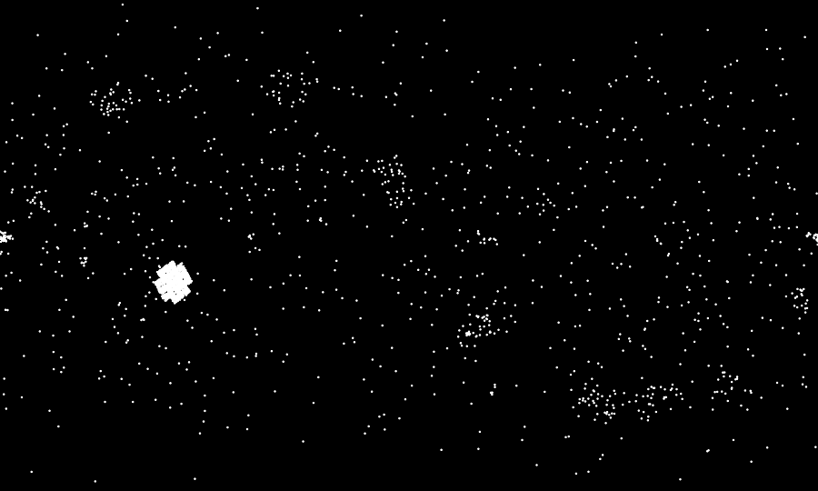
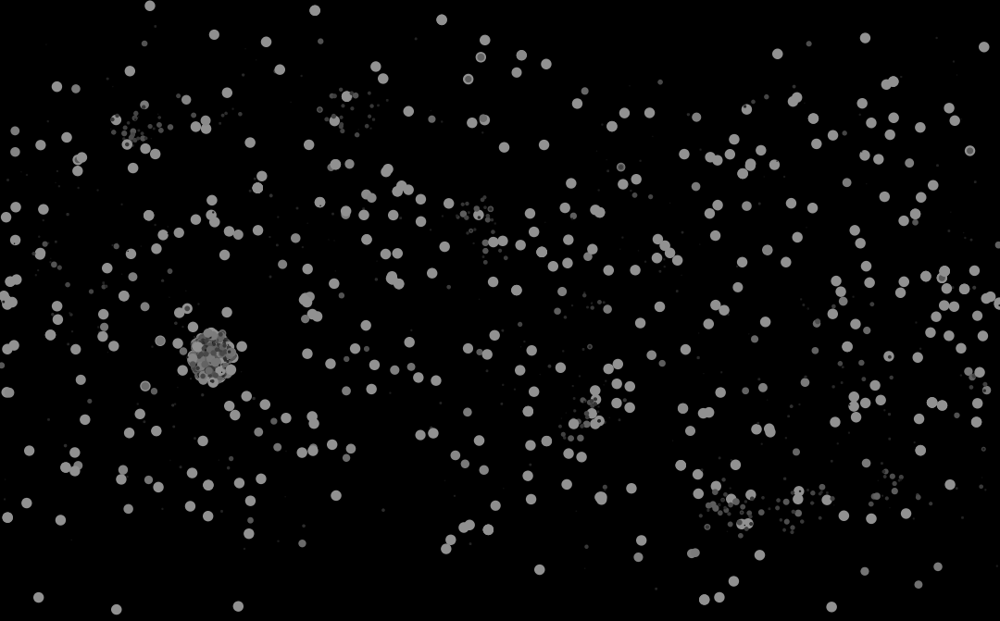
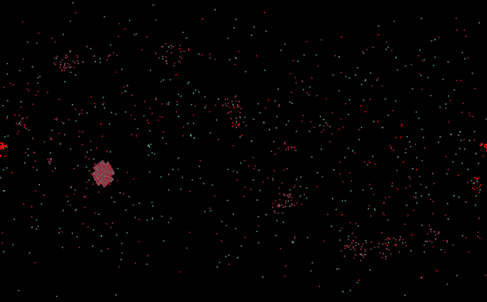
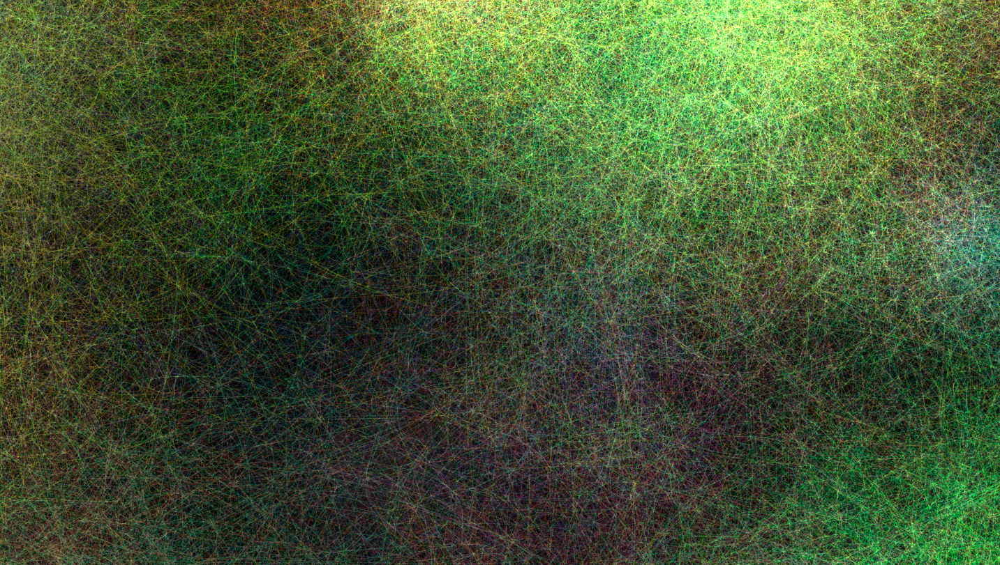
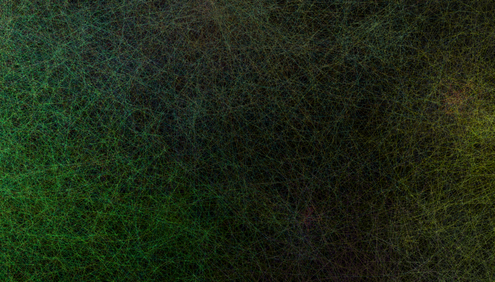
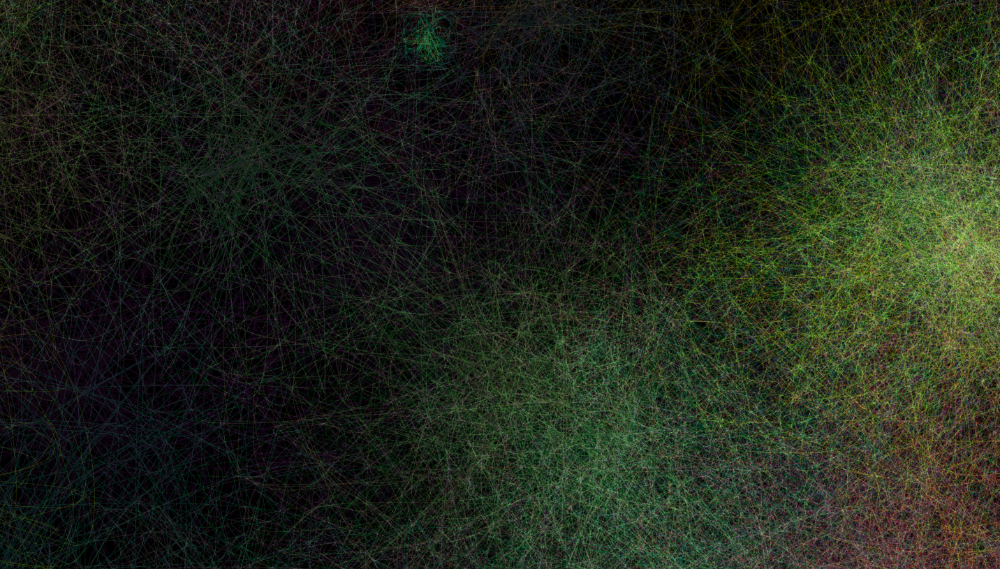
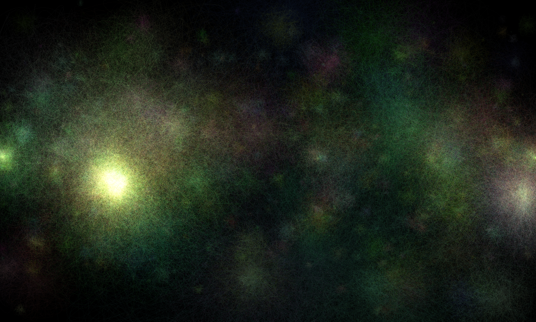
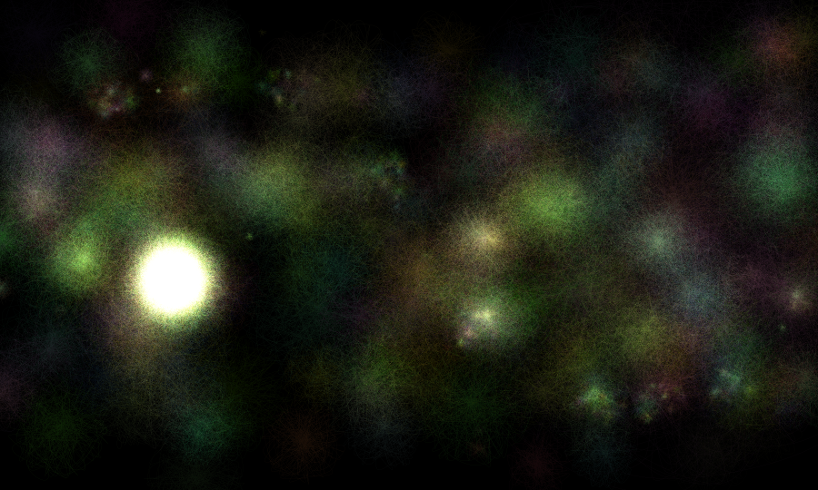

# Helsinki


## Creative process

I spent a lot of time trying to find data on the universe, but I didn't want to deal with too much complexity. This was the main limiter to what data I could use. This is why I ended up using Nasa Exoplanet Archive[^1], which has positions of the planets in the sky (in [galactic coordinates](https://en.wikipedia.org/wiki/Galactic_coordinate_system)). The galactic latitude and longitude were plotted on a cartesian map (corrected to fit the postcard format):



I couldn't find a reason for the cluster left of the image, but I suspect it is only an especially studied part of the universe and not an abnormally dense one. Since the effect in the end was good I decided to leave it there, but a more scientifically precise representation should take this into account.

The image is not particularly interesting, so I had to find a way to make it more compelling. The dataset offers many opportunities for this because it holds facts about each planet, such as orbital period, mass, density, radius, etc.

So I started experimenting with these other dimensions to create more variety. The most obvious steps were also the most boring ones: Controlling size and color of the ellipses that represent the planets doesn't help:





At this point one has to ask oneself: what am I doing? And the answer, surprisingly, was not science, but art. The point is that I was trying to use data creatively, not scientifically.

One thing that was bothering me about the above images, was they are too flat. The image that I have of the universe is smooth; with brightness and darkness; hues and colors from all over the spectrum (visible and invisible). That is what I had in mind from the beginning of my data collection exercise.

My solution to this conundrum was to create smooth areas by means of several thin lines semi-randomly disposed around each other, whose brightnesses add up.

## Step-by-step

In the beginning of the file we define some variables: `table` is used to read the CSV file with data; `scale` tells the program how many times the output size will be bigger than the input; `proportion` corrects the height to fit a postcard's proportion. The most important of these is `radiusType`, which defines the radius for the "fuzziness" around the planets.

```java
Table table;
int scale = 20;
float proportion = 1.244;
String radiusType = "PL_ORBPER";
```

The options for radiusType are:

- PL_ORBPER: Orbital Period [days]
- PL_MASSE: Planet Mass (Earth mass)
- PL_RADE: Planet Radius (Earth radii)

The image in the beginning of this chapter uses the Orbital Period (`pl_orbper`). Here is a detail from the same image:



The same area in an image generated with `PL_MASSE` looks like this:



And with `PL_RADE`:



Which amounts to:





The last variable in the beginning of the file is a class created by Daniel Shiffman[^2] for the Processing example on loading tabular data.

```java
Bubble[] bubbles;
```

Next we define the sketch size — which is the same as the output size. This needs to be done in `settings` because `setup` doesn't accept variables for `size()`;

```java
void settings() {
  size(360*scale, int(180*scale*proportion));
}
```

The `setup` function sets the background to black and blending mode to 'add'.

```java
void setup() {
  background(0);
  strokeWeight(1);
  noFill();
  blendMode(ADD);
  loadData();
}
```

Then we call the function `loadData()`, which loads the CSV data to our `table` variable — "header" just tells the function that the file has a header so we can access the columns by name (see `row.getFloat("st_glon")` and `row.getFloat("st_glat")`). We then set the `bubbles` array size to the number of rows in the table.

```java
void loadData() {
  table = loadTable("planets.csv", "header");
  bubbles = new Bubble[table.getRowCount()];

  int rowCount = 0;
  for (TableRow row : table.rows()) {
    float st_glon = row.getFloat("st_glon") * scale;
    float st_glat = (row.getFloat("st_glat") + 90) * scale * proportion;
    float radius = radius(row);

    bubbles[rowCount] = new Bubble(st_glon, st_glat, radius);
    rowCount++;
  }
}
```

The `for` loop iterates through each table row to populate the `bubbles` array (see below). We multiply the values with `scale` to position the points correctly in the output image. In `st_glat` we add 90 degrees to center the positions. We also multiply by `proportion` to rescale the height to fit the postcard.

The `radius` is returned by a separate function, which calculates it based on the value of `radiusType` defined at the top of the program.

```java
float radius(TableRow row){
  float radius = 0;
  switch(radiusType){
    case "PL_ORBPER":
      int pl_orbper = constrain(row.getInt("pl_orbper"), 0, 300);
      radius = log(pl_orbper) * 100;
      break;
    case "PL_MASSE":
      float pl_masse = row.getFloat("pl_masse");
      radius = pl_masse/5;
      break;
    case "PL_RADE":
      float pl_rade = row.getFloat("pl_rade");
      radius = pl_rade * 30;
      break;
  }

  return radius;
}
```

The arithmetic juggling is just a trick to bring the numbers to a usable range. It was found by trial and error.

The `Bubble` class takes an `x` and `y` parameters, which in the data are galactic longitude (`st_glon`) and latitude (`st_glat`) respectively.

After declaring the local variables we set a random color — with more likely to have green and red colors — for the current "planet", which is more like a cluster of lines. The colors are very faint because we will add many of them together. Then we set the local variables to use in the current object.

```java
class Bubble {
  float x,y;
  float radius;

  boolean over = false;

  PVector[] positions;
  color c = color(random(5, 30), random(5, 35), random(0, 25));

  Bubble(float x_, float y_, float radius_) {
    x = x_;
    y = y_;
    radius = radius_;
```

The last part of the class definition creates random positions around the center of the planet. Here is where the radiusType makes the difference because the planets orbital periods, mass and radius can vary a lot.

```java
    if(radius > 0){
      positions = new PVector[int(radius)];
      for(int i = 0; i < int(radius); i++){
        float randomR = random(radius);
        float randomA = random(360);
        float thisX = cos(radians(i * randomA)) * randomR + x;
        float thisY = sin(radians(i * randomA)) * randomR + y;
        positions[i] = new PVector(thisX, thisY);
      }
    }
  }
```

Because the numbers coming from `radius` are large, we end up with many random points, which we will use as vertices (`curveVertex()`) in the `display()` method to create the fuzzy effect. Bigger radii creates more points — that is longer, more curled up lines, with more vertices — and the area gets brighter.


```java
  void display() {
    stroke(c);

    beginShape();
    if(radius > 0){
      for(int i = 0; i < int(radius); i++){
        curveVertex(positions[i].x, positions[i].y);
      }
    }
    endShape();
  }
}
```

## References

[^1]: NASA Exoplanet Archive. https://exoplanetarchive.ipac.caltech.edu/.

[^2]: Shiffman, Daniel. https://processing.org/examples/loadsavetable.html.
