# Week 3: Straw


## Creative process

Most of the products made out of straw in Brazil, to my knowledge, are weaved. That was the first idea I tried to capture with this week's sketch.

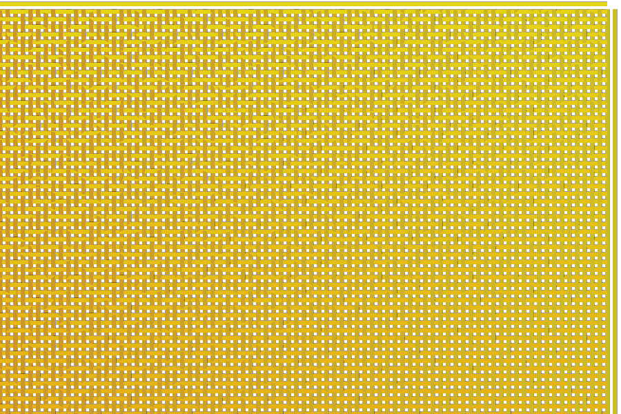

The effect is created by sine waves — seen from above — with different phases placed side by side. This is a literal translation of what is usually done by manual craftsmanship.

But usually this pattern just makes up the fabric for something else, like a hat or a mat. So I had the idea of bending the material.

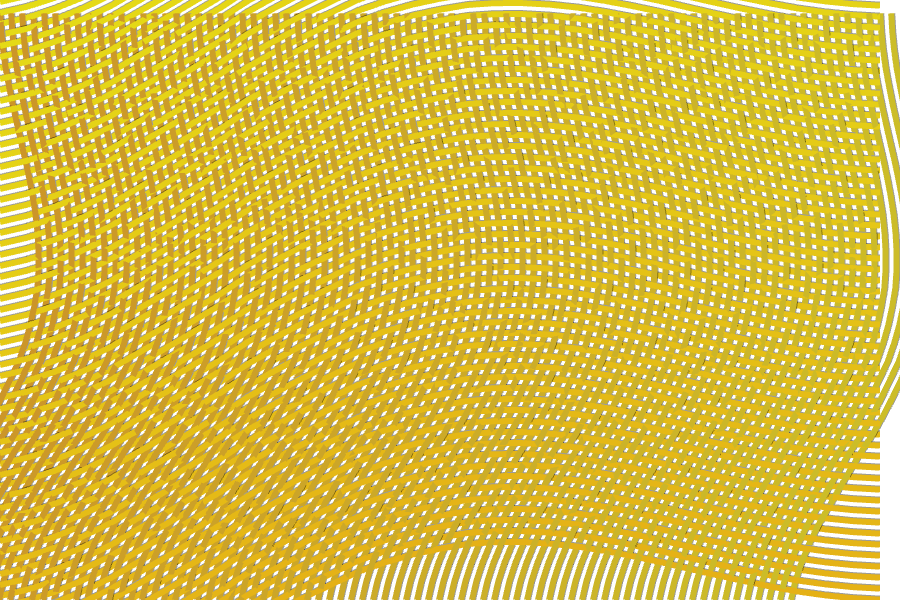

What I realized during this process is that the bending seemed more promising than the pattern, so I decided to follow that path instead.

I started from scratch with a simple grid. The idea was to bend these in several different ways to create some kind of fabric effect.

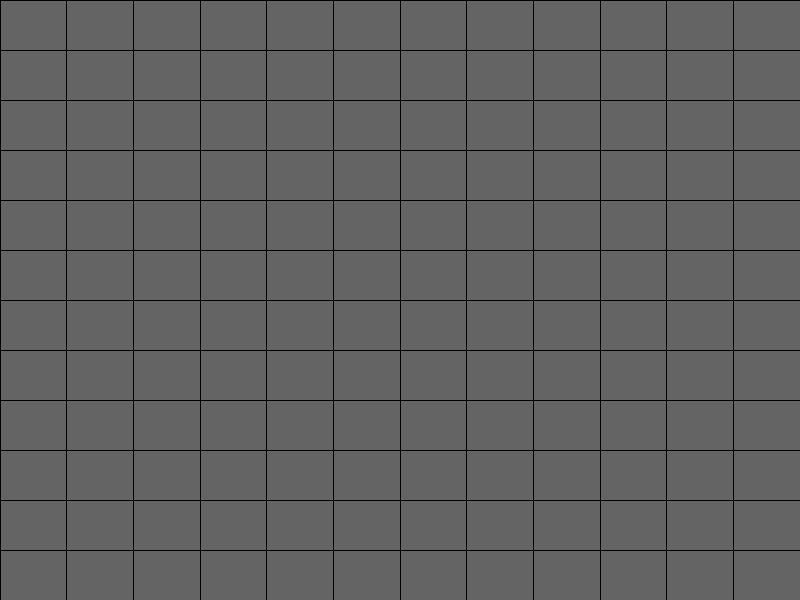

After a lot of work I ended up with something that I liked.

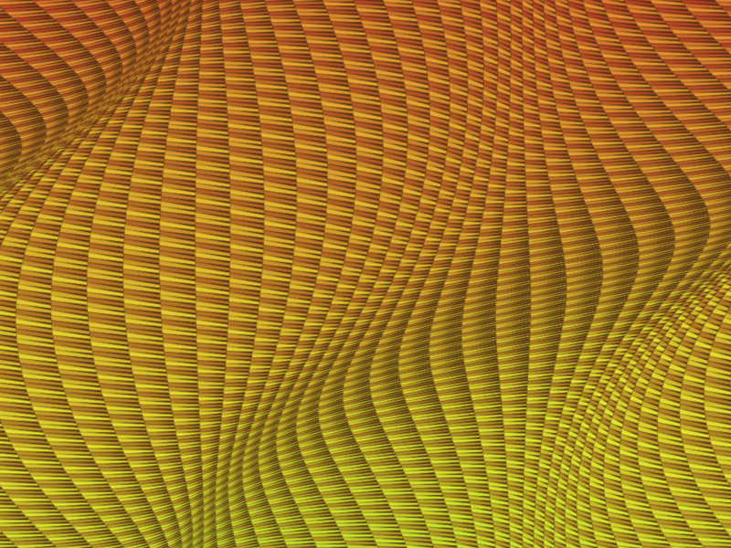

But there was a problem. When I started writing this explanation I realised I had made a mistake in the code. The loops for rows and columns were based on different ranges (`height` for `y` and `period` for `x`), so the result was actually casual, rather than what I had predicted.

```java
for(int y = 0; y <= height; y += rectWidth){
  for(int x = 0; x <= period; x += rectHeight){
```

Usually this wouldn't matter, since I would only care about the final result. But because I had to explain it here I also had to understand in detail.

Good enough, thought I, now I just need to go step by step again to figure out the 'correct' way to do this and only then explain.

Spoiler alert: I never managed to get to this point again with the new attempts. That is mostly because I ran out of time, but also because I found something I liked even more: the image at the top of the chapter.

I'll first explain the process and then go through the code. Keep in mind that I was trying to reproduce the above image, which I created mostly by chance.

Two things are happening here: the width of the columns and height of the rows are both varying horizontally and vertically. So my first step was to squeeze/stretch them.

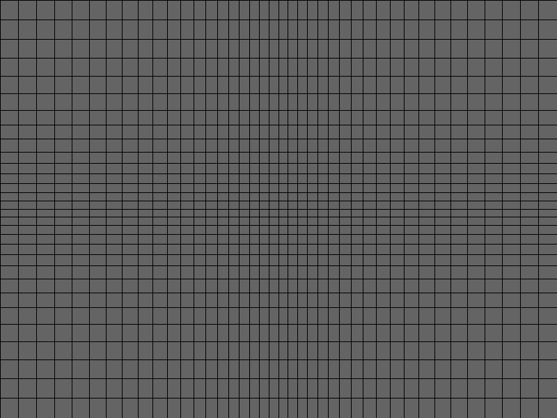

Here, every rectangle's vertices are shifted — left or right for row and up or down for column — based on a sine wave. Note that the rectangles in the middle are smaller and those at the edges are bigger.

Applying the shift in the other direction — that is, up and down for row and left and right for column — we get a flag.

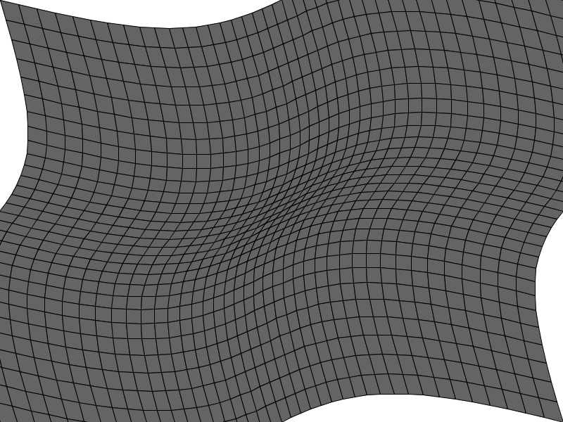

So far this is very uninteresting. But I still had hopes I could get to the point where I was before. So I decided to make the rectangles more straw-like but stretching them.

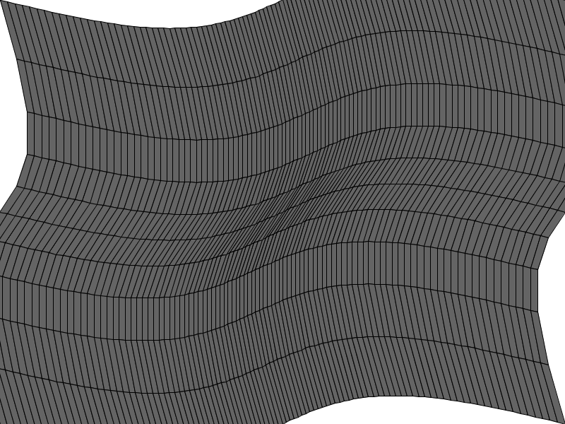

Now we just need to vary the variation to get a more interesting result. We do that by changing the phase of the heights according to the angle of the rows.

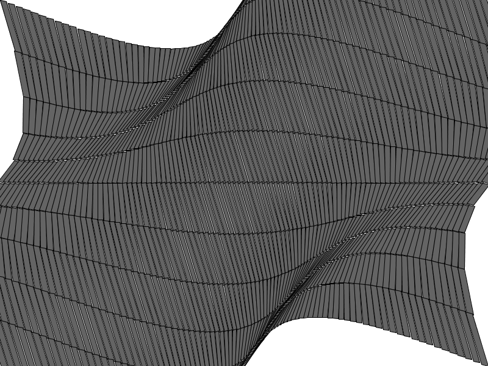

At this point it was not clear yet if I was going in the right direction, but I decided to pursue the path anyway. So I did what I had done before for the original image: Made one side of the rectangles smaller go make them look a little like straw.


Then modified the for loops to fill the whole area of the screen.


And added colors that vary across row and column.

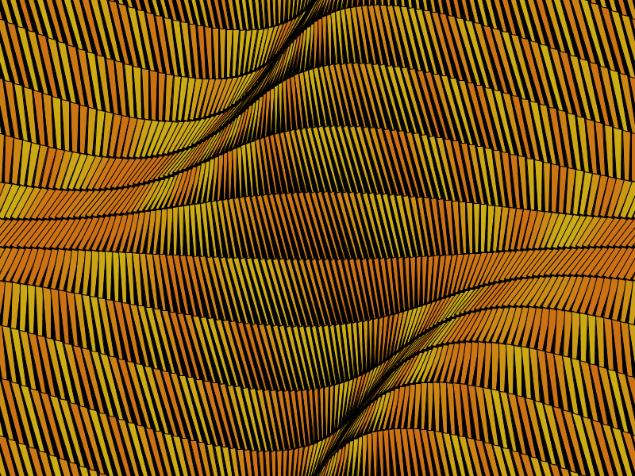

The final touch is to make the background a more interesting color. Rather a color gradient:


The final result is the image at the top. Plus a number of variations.


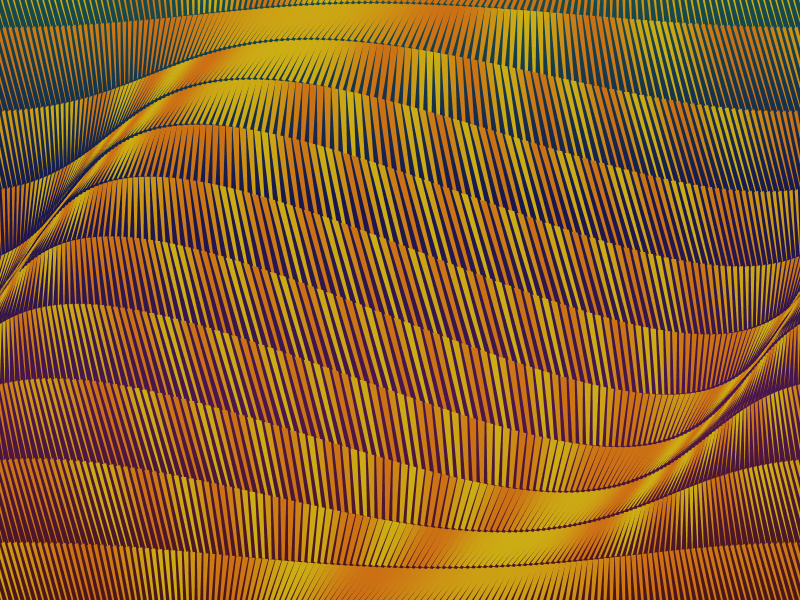

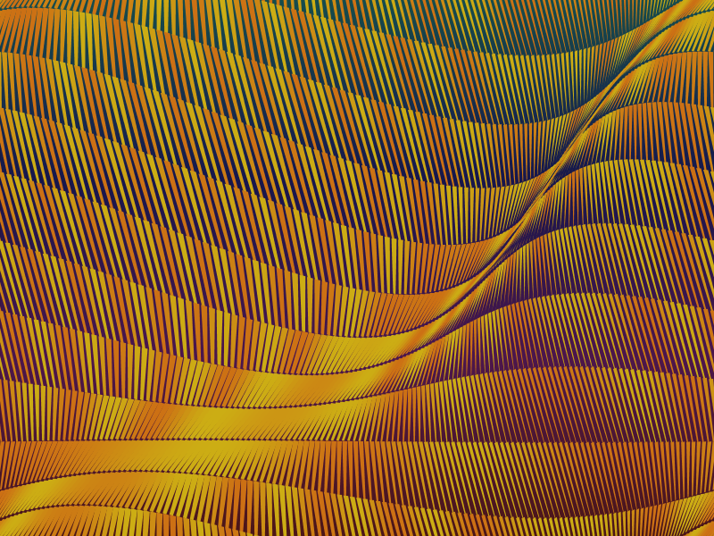

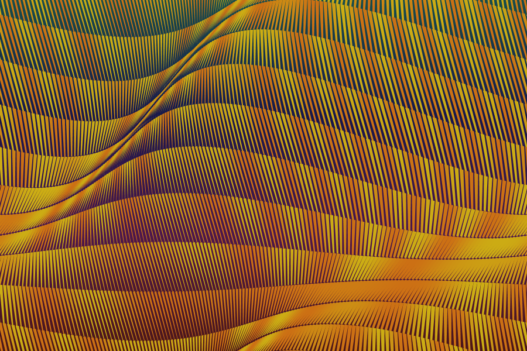
