Helsinki
========

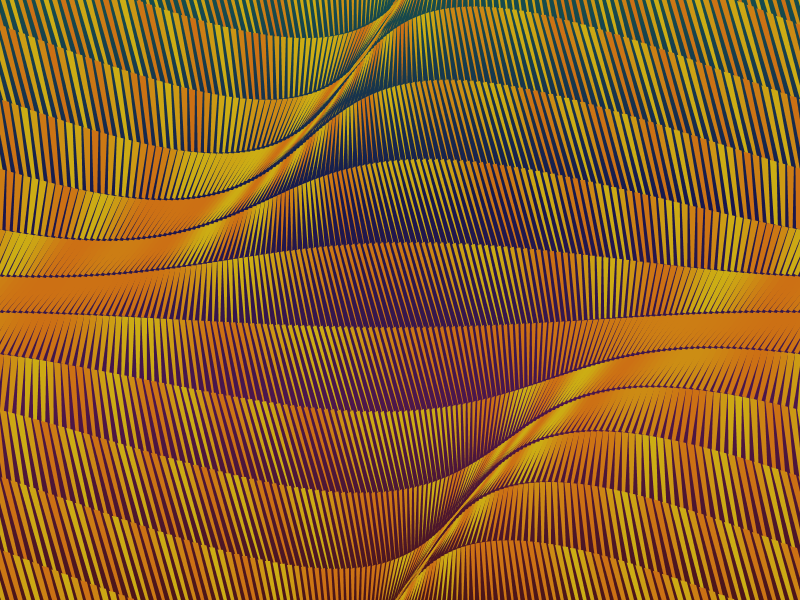

Creative process
----------------

Most of the products made out of straw in Brazil, to my knowledge, are
weaved. That was the first idea I tried to capture with this week's
sketch.

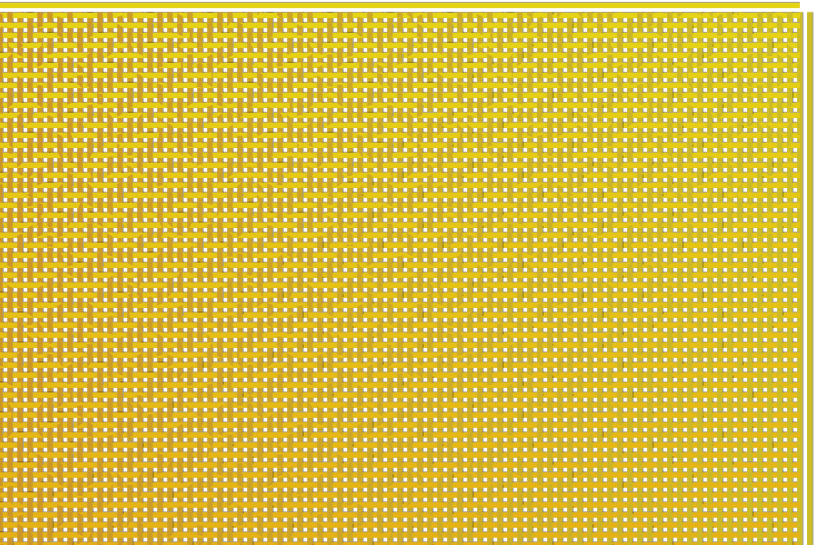

   The basic woof

The effect is created by sine waves — seen from above — with different
phases placed side by side. This is a literal translation of what is
usually done by manual craftsmanship.

But usually this pattern just makes up the fabric for something else,
like a hat or a mat. So I had the idea of bending the material.

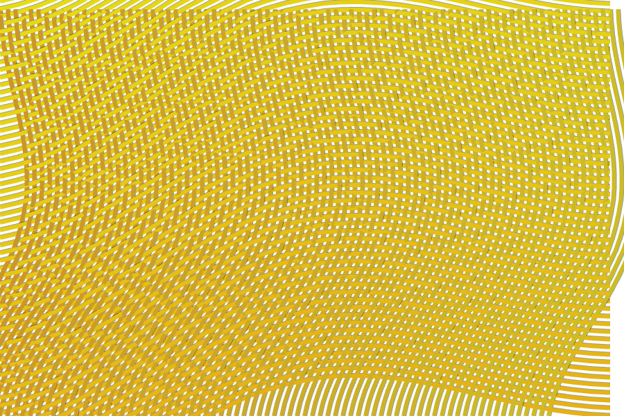

What I realized during this process is that the bending seemed more
promising than the pattern, so I decided to follow that path instead.

I started from scratch with a simple grid. The idea was to bend these in
several different ways to create some kind of fabric effect.

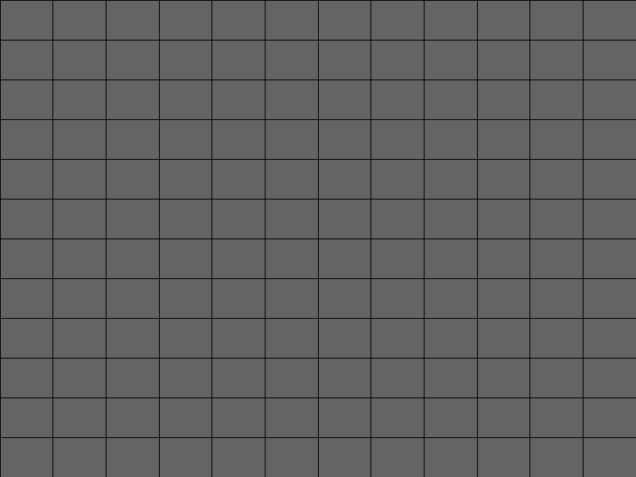

After a lot of work I ended up with something that I liked.

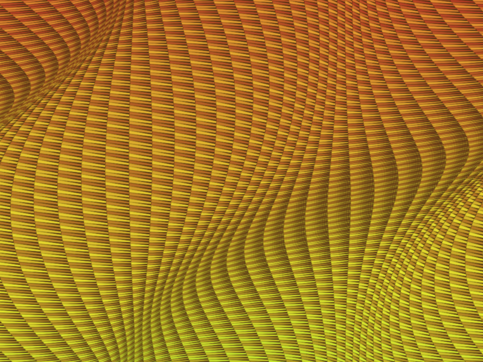

But there was a problem. When I started writing this explanation I
realised I had made a mistake in the code. The loops for rows and
columns were based on different ranges (``height`` for ``y`` and
``period`` for ``x``), so the result was actually casual, rather than
what I had predicted.

.. code:: java

    for(int y = 0; y <= height; y += rectWidth){
      for(int x = 0; x <= period; x += rectHeight){

Usually this wouldn't matter, since I would only care about the final
result. But because I had to explain it here I also had to understand in
detail.

Good enough, thought I, now I just need to go step by step again to
figure out the 'correct' way to do this and only then explain.

Spoiler alert: I never managed to get to this point again with the new
attempts. That is mostly because I ran out of time, but also because I
found something I liked even more: the image at the top of the chapter.

Step by step
------------

Unlike the previous chapters, for this one I thought it would be more
fruitful to actually build the program from scratch here instead of
going through the code line by line. But as usual you can find the code
on `Github <https://github.com/regisfrias/dear-gen>`__.

Here's how we create the basic grid. We need to define sizes for our
rectangles and because we want them to be strips in the end, let's keep
width and height separate. These are global variables.

.. code:: java

    int rectWidth = 60;
    int rectHeight = 40;
    float period = 360;
    float variationY;
    float variationX;

We also define a period to be able to control the frequency of the
bending and the amount of variation for each axis (more on this below).

Also we need separate ``x`` and ``y`` variables for each of the vertices
so that we can control them independently — otherwise we would just get
rectangles in the end.

And the function that creates the grid looks like this:

.. code:: java

    void drawRects(){
      for(int x = 0; x <= width; x += rectWidth){
        if(x > 0){
          float prevX = x - rectWidth;
          for(int y = 0; y <= height; y += rectHeight){
            if(y > 0){
              float prevY = y - rectHeight;

              float x1 = prevX;
              float x2 = x;
              float x3 = x;
              float x4 = prevX;

              float x1 = prevY;
              float x2 = prevY;
              float x3 = y;
              float x4 = y;

              beginShape();
              vertex(x1, y1);
              vertex(x2, y2);
              vertex(x3, y3);
              vertex(x4, y4);
              endShape(CLOSE);
            }
          }
        }
      }
    }

What this function is doing is getting ``x`` and ``y`` from the ``for``
loop and assigning it to some of the vertices. But we also need the
previous vertices to be able to move the current one together with the
previous.

Note that some of the vertices are the same for now (for instance ``x1``
and ``x4``), but we will change them later.

That is what ``float prevX = x - rectWidth;`` and
``float prevY = y - rectHeight;`` are doing. The ``if`` statements just
prevent us from getting negative values for when: ``0 - rectWidth``
would be equal to -rectWidth.

What we're effectively doing is skipping the first set of vertices and
drawing the rectangles starting from the second to the first, then third
to second and so on.

Don't forget to initialize the variation variables and give the output a
size in setup:

.. code:: java

    void setup(){
      size(800, 600);
      variationX = 40;
      variationY = 40;
      colorMode(HSB, 360, 100, 100);
    }

Since we're here, let's also change the color mode to
hue/saturation/brightness so the color system is more intuitive.

Two things are happening to build the target image: the width of the
columns and height of the rows are both varying horizontally and
vertically. So first we want to squeeze or stretch them in only one
direction, to keep things simple.

Inside of the ``x`` loop we add the following:

.. code:: java

    float prevAngleX = map(prevX, 0, width, 0, period);
    float angleX = map(x, 0, width, 0, period);
    float prevBendX = sin(radians(prevAngleX)) * variationX;
    float bendX = sin(radians(angleX)) * variationX;

Because we are bending things in a cyclical manner, we use sine waves to
perform the task. This is why we use angles instead of absolute ``x``
and ``y`` positions. Also, I'm using angles instead of radians because
it makes the code more intuitive. But Processing has a handy function to
convert them to radians, that the ``sin()`` function needs.

What ``bendX`` and ``prevBendX`` are doing is to go through ``0`` to
``360`` and giving us sine values for each step times the amount of
variation we want (``variationX``). This means that the sine wave,
instead of varying between ``-1`` and ``+1``, will vary between
``-variationX`` and ``+variationX``.

Next we just need to add the variations to each of the vertices. We need
to keep previous ``x`` positions from current ones to make sure the
vertices match at each row.

.. code:: java

    float x1 = prevX + prevBendX;
    float x2 = x + bendX;
    float x3 = x + bendX;
    float x4 = prevX + prevBendX;

If we now do the same for the ``y`` axis we will have the following:

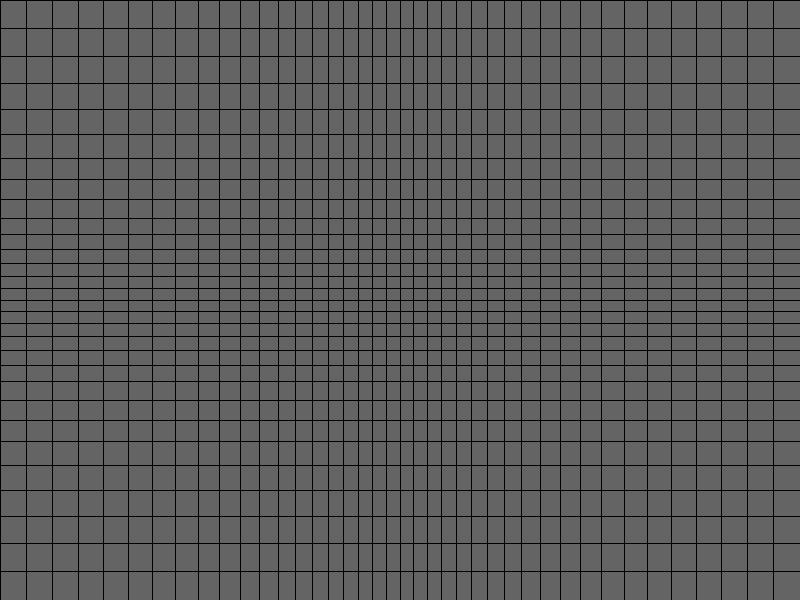

Just to spell out, we add the bending variables to the ``y`` loop:

.. code:: java

    float prevAngleY = map(prevY, 0, height, 0, period);
    float angleY = map(y, 0, height, 0, period);
    float prevBendY = sin(radians(prevAngleY)) * variationY;
    float bendY = sin(radians(angleY)) * variationY;

Then we add these values to the vertices:

.. code:: java

    float y1 = prevY + prevBendY;
    float y2 = prevY + prevBendY;
    float y3 = y + bendY;
    float y4 = y + bendY;

Here, every rectangle's vertices are shifted — left or right for row and
up or down for column — based on a sine wave. Note that the rectangles
in the middle are smaller and those at the edges are bigger.

Applying the shift in the other direction — that is, up and down for row
and left and right for column — we get a flag.

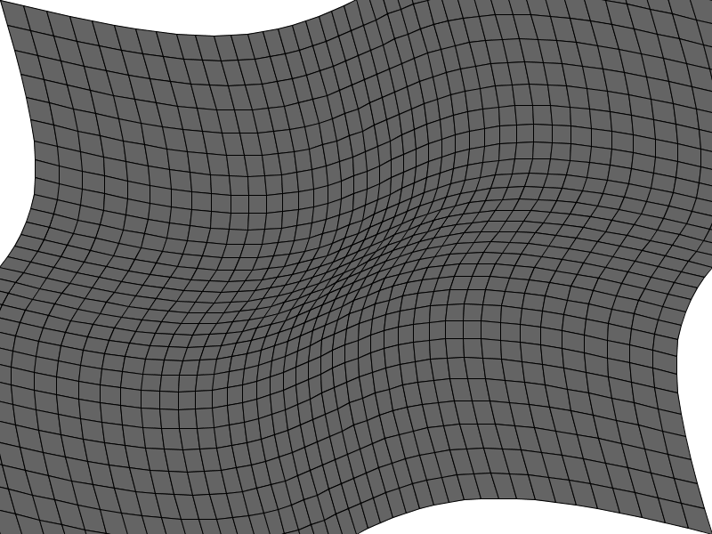

The vertices now look like this:

.. code:: java

    float x1 = prevX + prevBendX + prevBendY;
    float x2 = x + bendX + prevBendY;
    float x3 = x + bendX + bendY;
    float x4 = prevX + prevBendX + bendY;

    float y1 = prevY + prevBendY + prevBendX;
    float y2 = prevY + prevBendY + bendX;
    float y3 = y + bendY + bendX;
    float y4 = y + bendY + prevBendX;

So far this is very uninteresting. But I still had hopes I could get to
the point where I was before. So I decided to make the rectangles more
straw-like by stretching them.

.. figure:: ../assets/03-streched-rects.png
   :alt:

Then I wanted to vary the variation to get a more interesting result. We
do that by changing the phase of the y angles according to the x angles.
Like so:

.. code:: java

    float prevBendY = sin(radians(prevAngleY + prevAngleX)) * variationY;
    float bendY = sin(radians(angleY + angleX)) * variationY;

Here we broke the connection between previous and current points. To fix
this we would need four different bend variables. But here the effect
was actually to our benefit. The fact that the vertices don't match
anymore makes them look more like organic material that was weaved by
hand. Well, sort of. I wasn't aiming at imitation, but at an interesting
result derived from the theme. And this is how the current stage looked
like to me.

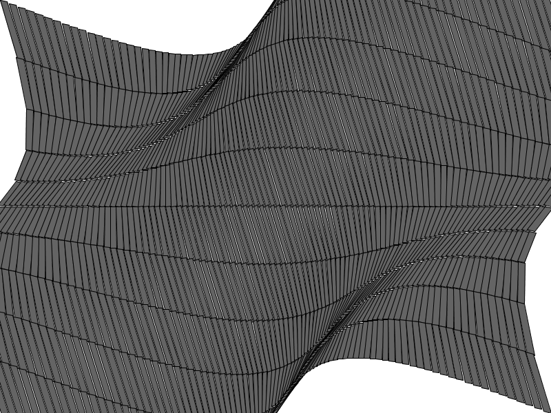

At this point it was not clear yet if I was going in the right
direction, but I decided to pursue the path anyway. So I did what I had
done before for the original image: Made one side of the rectangles
smaller to make them look a little like straw.

.. figure:: ../assets/03-smaller-side.png
   :alt:

This is achieved by making one of the vertices smaller by a fraction of
the variation:

.. code:: java

    float x3 = x + bendX + bendY - variationY/10;

Then need to modify the ``for`` loops to fill the whole area of the
screen and get rid of the annoying flag effect.

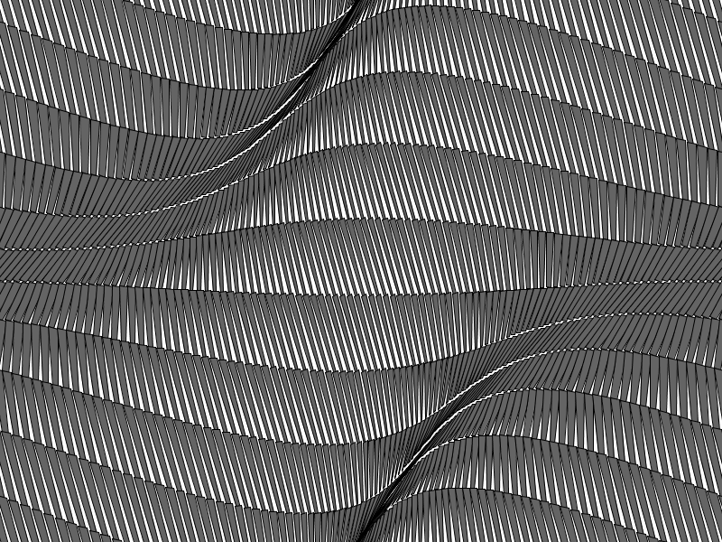

So the loops will be:

.. code:: java

    for(int x = -int(variationX + rectWidth); x <= width + variationX + rectWidth; x += rectWidth)

And:

.. code:: java

    for(int y = -int(variationY + rectHeight); y <= height + variationY + rectHeight; y += rectHeight)

The ``if`` statements must also reflect this:

.. code:: java

    if(x > -variationX - rectWidth)

And:

.. code:: java

    if(y > -variationY - rectHeight)

Now we can add some colors that vary according to both row and column.
We do that with a sine wave. Here we don't care so much about angles, we
just want the colors to vary a lot. So we can use any vertex as angle.

.. code:: java

    float h = sin(radians(y1*20 + x1)) * 10 + 40;
    fill(h, 90, 80);

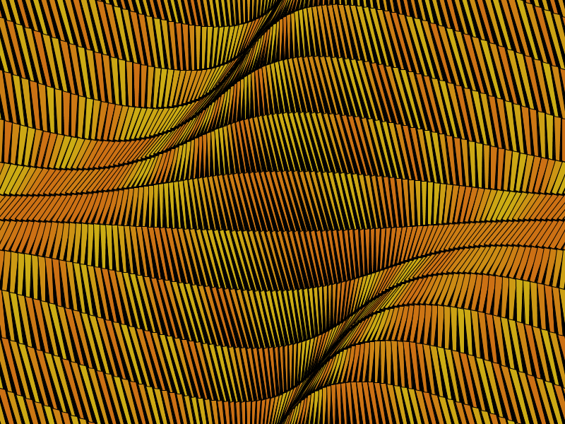

The final touch is to make the background have a more interesting color. Or
rather a color gradient with the following code:

.. code:: java

    for(int y = 0; y < height; y++){
      float h = map(y, 0, height, 180, 360);
      stroke(h, 70, 30);
      line(0, y, width, y);
    }

Here we're just drawing one-pixel thick lines from the top of the screen
to the bottom. The hue will vary from ``180`` to ``360`` so we don't get
the full rainbow spectrum.

The final result is the image at the top. Plus a number of variations.

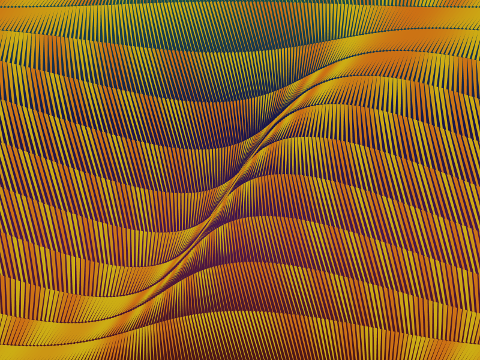

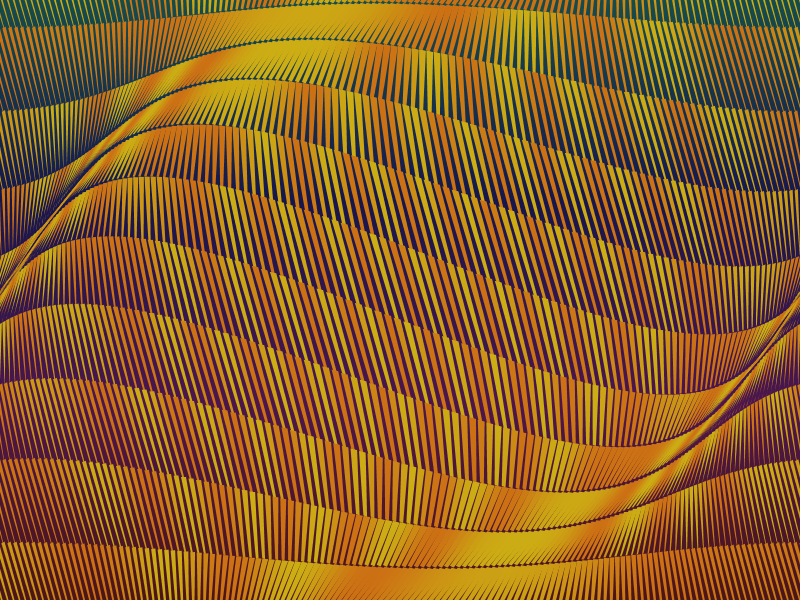

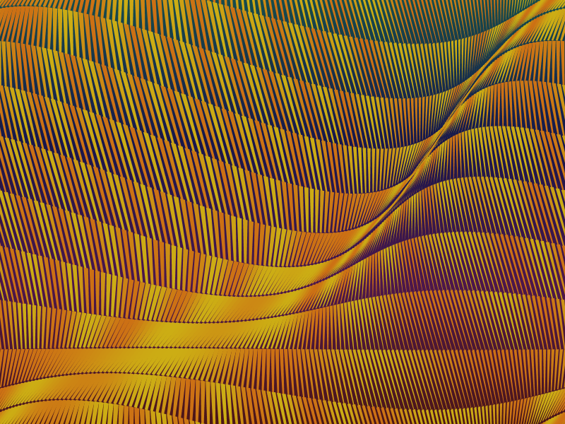

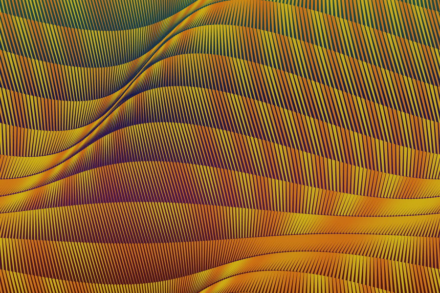
