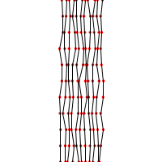

Stockholm
=========

.. figure:: ../assets/03-sto-medium.jpeg
   :alt:

Creative process
----------------
For **Palha** I was initially set in a more literal exploration of the subject, either by drawing a simple product made of straw, such as rural worker straw hat, or simply a weave pattern. 
After watching a video about straw weaving, I spend some time trying to come up with a simple way to mimic the artisans movement with code. The most basic weaving movement involves alternating straw threads, so that they either go above, or under, another thread. 

I decided to abandon this idea when I realized that it would be easier in 3D than 2D. Régis presents a more succinct explanation in his sketch, saying that the thread can be represented by sinodal waves with different phases - meaning waves where the "high" and "low" points are in slightly different locations.

(picture)

Organic threads
---------------
Each thread of the straw weave is composed by 10 individual "lines". The simplest way to draw a line in 
Processing is to use ``line()`` [1]_, providing the coordinates of the starting and end points.

.. code-block:: Java
    :emphasize-lines: 3

    void strawStraightLines(float x, float y, float w, float h ) {
    for (int j=0; j<=10; j++) {
        line(x, y, x, y+h);
        translate(w/10, 0);
    }
    }

To make the output more organic, we can replace the straight line with smaller line segments which connect points in varying positions.

+--------------------+---------------+---------------------+
| Straight lines     | Line segments | Segments with noise |
+--------------------+---------------+---------------------+
| |image0|           | |image1|      | |image2|            |
+--------------------+---------------+---------------------+

Drawing a mesh
--------------
To be continued.

Other techniques
----------------

* Palette  

While drawing the thread, I randomly pick one item from a list of 5 colors.  
The technique is described in :ref:`techniques-palette`. 

.. [1] https://processing.org/reference/line\_.html