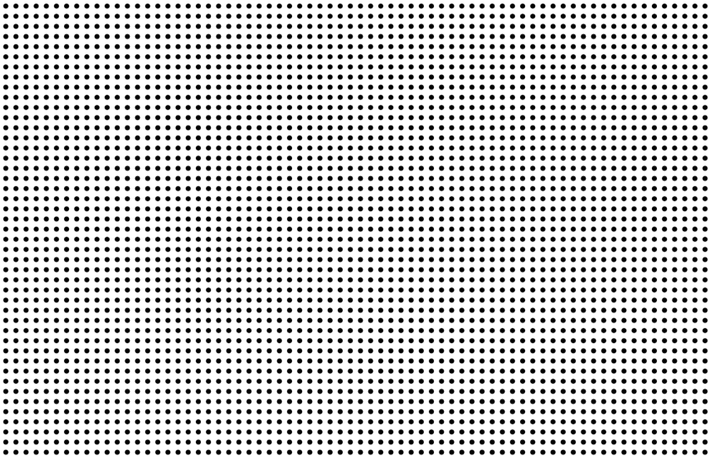
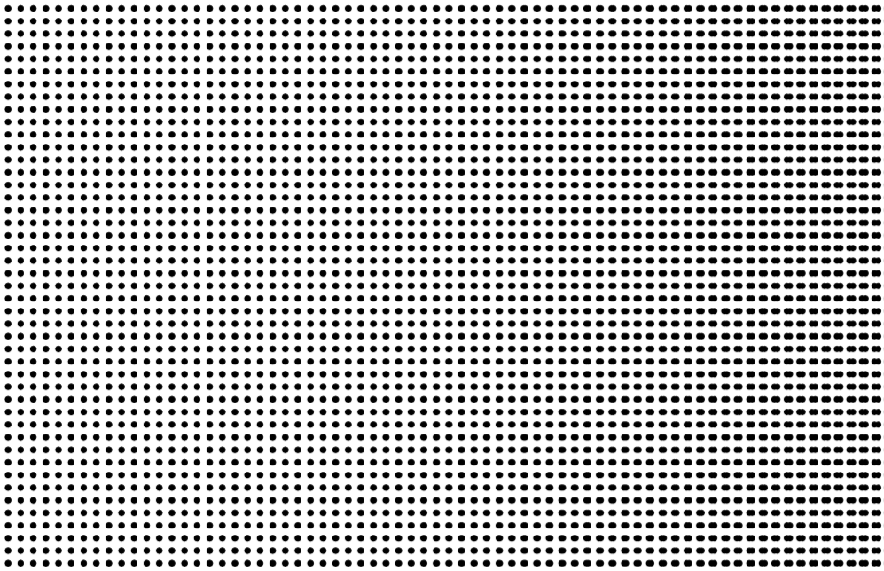
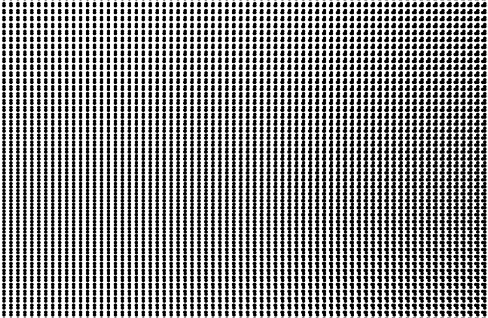

Helsinki
========

.. figure:: ../assets/04-helsinki.png
   :alt:

The idea
--------

Infinitesimal is the smallest size one can think of. The main mediu in this project is not the pixel, but the printed point. In this sketch I decided to explore the possibilities created by the smallest printed element.

Moiré patter is a usually undesired effect that happens when two patterns overlap and create a third one. In this sketch I divised two moiré patterns: a predetermined one and a potential one. The former can be seen when you view the image at 100% of its size. The latter can be seen if you resize the image or — even better — point a camera to it and move your perspective perpendicularly. The pattern of pixels on your camera will overlap with the image and create a jittering effect.

While the second effect is difficult to explain — because it is very sensitive to the circumstances — the first one is very simple: a grid of equally spaced dots is overlayed to two other similar grids, but whose dots distance vary slightly on the horizontal and the vertical axes respectively.

   A grid of equally spaced dots horizontally.

  The previous grid overlapped on a grid of dots whose horizontal distances varies slightly.

  The final image: same as the previous image overlayed on a grid of dots whose vertical distances varies slightly.

Again, the focus of this project is the printed image, so this drawing had to be saved as a PDF. The main point is that the dots — small ellipses — are only rasterized by the printer's software. This is a guarantee that they will be printed as points and will not be converted to pixels before then.

The code
--------

First we import the PDF library so we can save the image in that format. Then we define a spacing for our grid. On the applet window this will be in pixels, but on the PDF it will be dots.

.. code:: java

  import processing.pdf.*;
  int spacing = 2;

  void setup() {
    size(551, 359);
    noLoop();
  }

We begin with a function to create a very simple grid of ellipses:

.. code:: java

  void generateGrid(){
    for (int x = 0; x < width; x += spacing) {
      for (int y = 0; y < height; y += spacing) {
        noStroke();
        fill(0);
        ellipse(x, y, 1, 1);
      }
    }
  }

Then we call the function inside the loop:

.. code:: java

  void draw(){
    generateGrid();
  }

This will give us the first, unaltered grid. Now we need a method to decide if the other grids will be have their distances bent on the vertical or horizontal axes. For that we create one boolean for each axis:

.. code:: java

  generateGrid(boolean isBentX, boolean isBentY)

Next we need to vary the ``x`` and ``y`` across their respective axes. So we map the current value of each from the screen size scale to half a cosine cycle. We could also use a full cycle, but then the pattern looks too repetitive.

.. code:: java

  float positionXToAngle = map(x, 0, width, 0, 180);
  float offsetX = cos(radians(positionXToAngle)) * spacing;

  float positionYToAngle = map(y, 0, height, 0, 90);
  float offsetY = cos(radians(positionYToAngle+45)) * spacing;

Then we need to check if we need to vary the dots spacing vertically or horizontally:

.. code:: java

  if(!isBentX) { offsetX = 0; }
  if(!isBentY) { offsetY = 0; }

Finally we add the variation to the position of the dot:

.. code:: java

  ellipse(x + offsetX, y + offsetY, 1, 1);

The function now looks like this:

.. code:: java

  void generateGrid(boolean isBentX, boolean isBentY){
    for (int x = 0; x < width; x+=spacing) {
      for (int y = 0; y < height; y+=spacing) {
        float positionXToAngle = map(x, 0, width, 0, 180);
        float offsetX = cos(radians(positionXToAngle)) * spacing;

        float positionYToAngle = map(y, 0, height, 0, 90);
        float offsetY = cos(radians(positionYToAngle+45)) * spacing;

        if(!isBentX) { offsetX = 0; }
        if(!isBentY) { offsetY = 0; }

        noStroke();
        fill(0);
        ellipse(x + offsetX, y + offsetY, 1, 1);
      }
    }
  }

And we call it inside ``draw()`` three times: the original, the vertically altered, and the horizontally altered.

.. code:: java

  generateGrid(true, false);
  generateGrid(false, true);
  generateGrid(false, false);

To save the file we call ``beginRecord()`` and ``endRecord()``. The final ``draw()`` function looks like this:

.. code:: java

  void draw() {
  String fileName = "saved/" +
                    year() +"-" +
                    month() + "-" +
                    day() + "-" +
                    hour() + "-" +
                    minute() + "-" +
                    second() +
                    "-infinitesimal.pdf"; minute() + "-" + second() + "-infinitesimal.pdf";
    beginRecord(PDF, fileName);
    background(255);

    generateGrid(true, false);
    generateGrid(false, true);
    generateGrid(false, false);

    endRecord();
    exit();
  }
