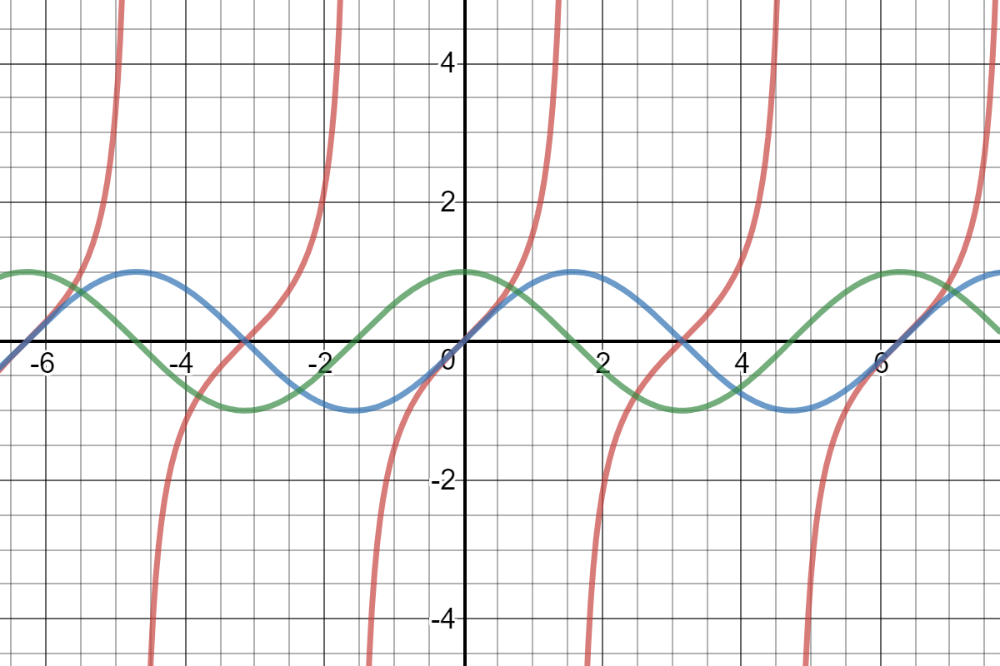
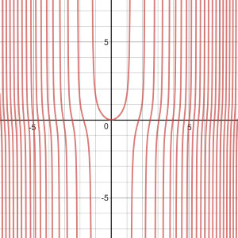
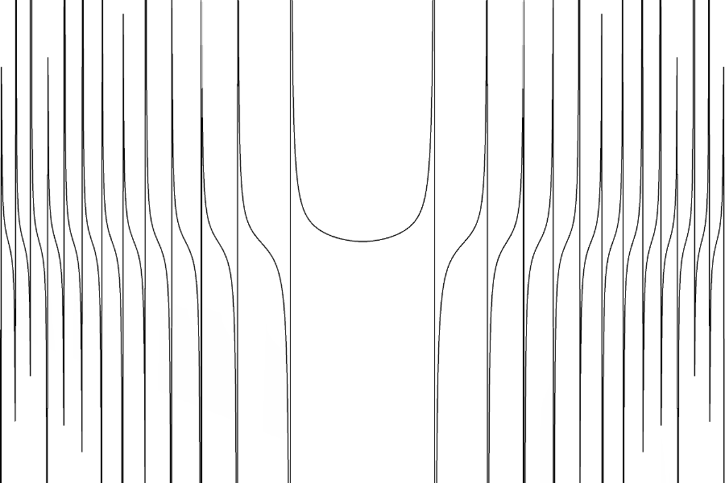
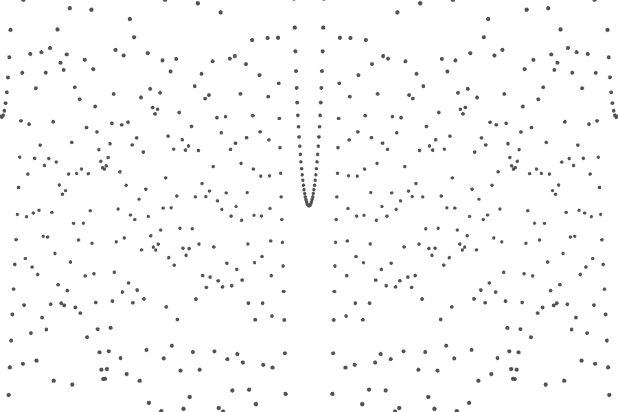
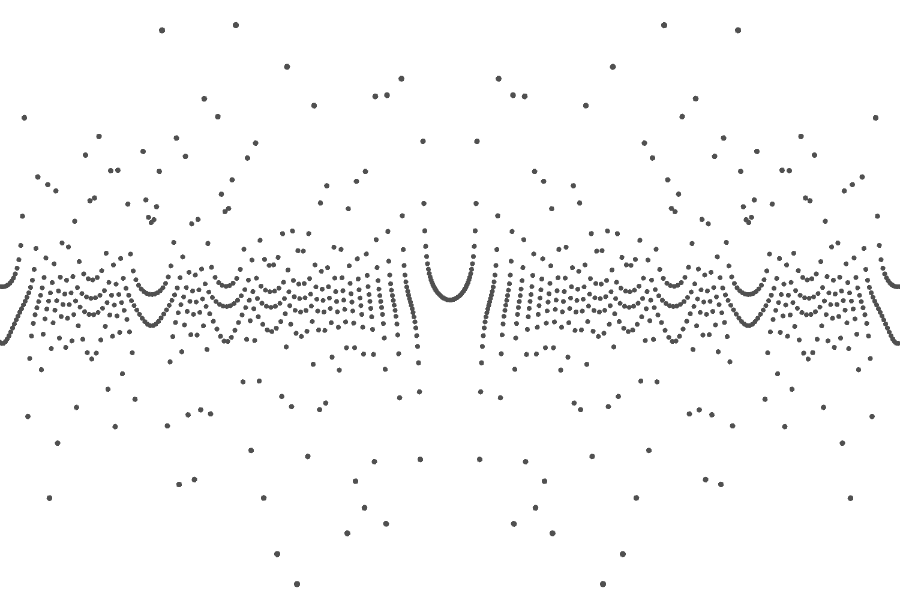
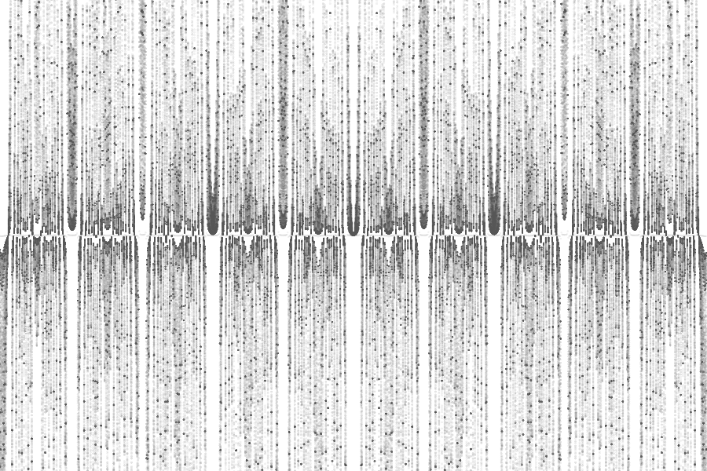

Stockholm
=========

.. figure:: ../assets/04-stockholm.jpg
   :alt:

*Infinitesimal* is the word to represent the minuscule, the so small is that almost not there. It is a concept 
frequent in mathematics, more specific in the early studies of calculus. I did not want to dig too deep in the mathematical 
exploration of the concept, but as a starting point, I chose to play with drawing points along the `tangent` function.
The choice for the `tangent` was simply because it is the trigonometric function which has a limit to infinity for certain input values. 
Sine and cosine functions, on the other hand, always return values between -1 and 1.  

    
            Tangent (red), sine (blue) and cosine (green) functions.

I started then playing with variations to the input for `tangent` function. For example, :math:`y = tan(x^2)`

    
    :math:`y = tan(x^2)`

In Processing, I can generate a similar shape by using a loop to calculate the `y` value. 

.. code-block:: Java

    beginShape();
    for (float i = 0; i < n; i++) {
        float x_screen = w/n  * i;
        float x = map(i, 0, n, -TWO_PI, TWO_PI);
        float y = tan(a*x*x) * map(mouseX, 0, width, 1, 1000);
        
        vertex(x_screen, -y);
    }
    endShape();

Note that I use `x_screen` as the place to draw in the screen, mapping the `i` values from 0 to `width`, and `x` as the input 
of the `tangent` function, which I chose to map between :math:`-2*pi` and :math:`2*pi`.

    
            Processing output.

After that I changed the code so that I draw small ellipses instead of drawing the line segments. 

.. code-block:: Java
    :emphasize-lines: 5,6

    for (float i = 0; i < n; i++) {
        float x_screen = map(i, 0, n, 0, w);
        float x = map(i, 0, n, -TWO_PI, TWO_PI);
        float y =tan(a*x*x);// * map(mouseX, 0, width, 1, 1000);
        s= 8 + 6*pow(abs(y/h), 1.2);
        ellipse(x_screen, -y, s, s);
    }

The images below show the outputs with the `a` variable set to 1 and 10.

    
            Processing output of the intermediate sketch (a=1)

    
            Processing output of the intermediate sketch (a=10)

For the final version, I removed the `background(255)` command, so that the drawing accumulates in the screen, and adjusted the
transparency for 20. After running the sketch and moving the mouse for a couple of seconds, you get a image similar to the one below.

    
            Processing output of the final sketch (`a=100, alpha = 20`).