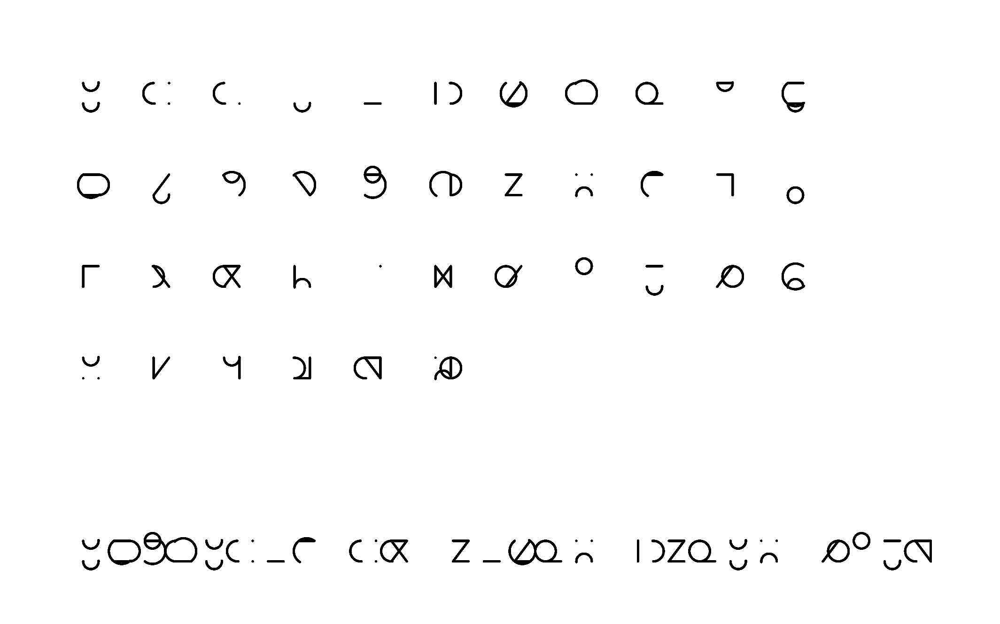
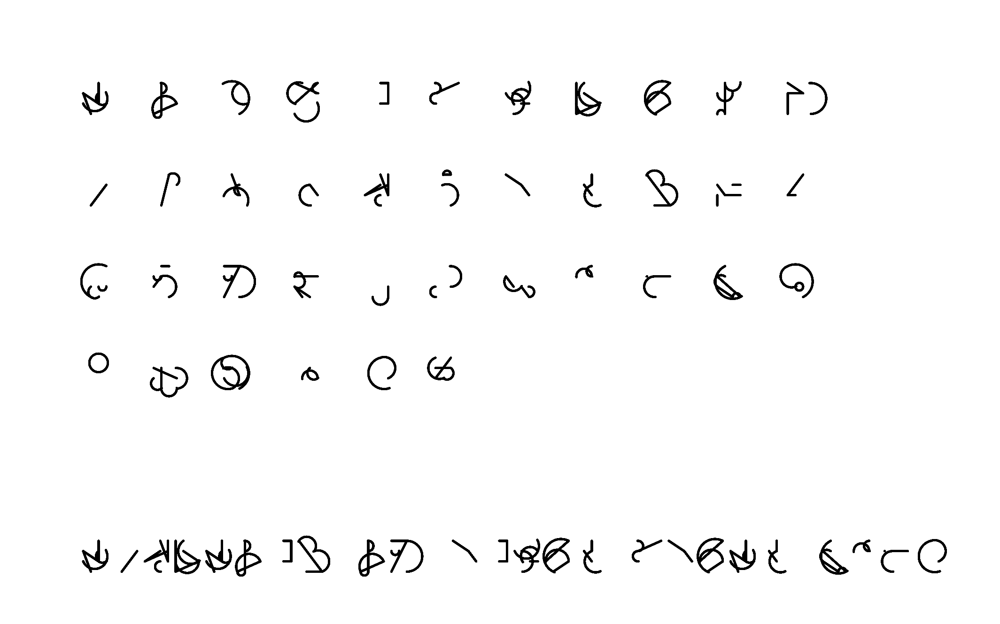

Helsinki
========

.. figure:: ../assets/05-helsinki.png
   :alt:

I have always been fascinated by the incredible variety of signs that humans have created throughout our history in order to communicate between each other. This sketch is a humble tribute to this amazing resource. This is also the most complex sketch I have made so far for this project, so this account is doomed to be incomplete. I invite the reader to inspect the code and try to understand in more detail by herself.

The creative process
--------------------

Rather than creating an alphabet, I wanted to create an alphabet generator, but what does that even mean? Real alphabets come from a people's everyday communication needs and I could never dream of achieving something of the same complexity and elegance with a dumb algorithm. Nevertheless I wanted to create alphabets that look interesting enough and that could fool someone who is not paying a lot of attention.

My main inspiration were handwritten letters, because they embed their gestural inception in their form. That is why a manuscript written with a feather has a contrast of think and thin strokes, which lends them their character.

.. figure:: ../assets/05-Illuminated.bible.closeup.arp.jpg
  :alt: A closeup of the illuminated letter P in the 1407AD Latin Bible on display in Malmesbury Abbey, Wiltshire, England.

  A closeup of the illuminated letter P in the 1407AD Latin Bible on display in Malmesbury Abbey, Wiltshire, England. It was hand written in Belgium, by Gerard Brils, for reading aloud in a monastery. Photo: Adrian Pingstone. Source: `https://en.wikipedia.org/wiki/File:Illuminated.bible.closeup.arp.jpg <https://en.wikipedia.org/wiki/File:Illuminated.bible.closeup.arp.jpg>`_

The Sumerian script known as *cuneiform* owes its shape to the wedges left by the stylus used to write it on clay tablets. The system is composed of simple stylus strokes combine in different ways.

.. figure:: ../assets/05-cuneiform_script2.png
  :alt: Cuneiform script tablet from the Kirkor Minassian collection in the Library of Congress.
  :align: center

  Cuneiform script tablet from the Kirkor Minassian collection in the Library of Congress. From Year 6 in the reign from Amar-Suena/Amar-Sin between 2041 and 2040 BC. `http://hdl.loc.gov/loc.amed/amcune.cf0013 <http://hdl.loc.gov/loc.amed/amcune.cf0013>`_. Source: `https://en.wikipedia.org/wiki/File:Cuneiform_script2.png <https://en.wikipedia.org/wiki/File:Cuneiform_script2.png>`_

The hallmark of mechanical processes are the geometrical forms, most notably the straight line and the circle, which were my translation of the idea of gestures in this sketch. They were also were the main elements I used to restrict the repertoire of gestures and give the impression of a writing system. The other element is :ref:`the letter grid <the-grid>`.

This gave me the following algorithm:

#. Decide how many "pen strokes" to draw;
#. Choose a starting point for it on the grid (:ref:`ref. to image below <the-grid>`);
#. Choose an ending point for it on the grid;
#. Choose a line type: straight or an arc;
#. Draw the line from starting to ending point;
#. If this was the last line, stop, otherwise:
#. choose if the starting point is the same as the current ending point or a new, random one;
#. go back to #3;

This is also the structure of the main algorithm and a description of the program core. What is missing from here is the positioning system — where to draw the letters for the full alphabet — and the sample text (which I will not cover in this explanation).

.. _the-grid:

.. figure:: ../assets/05-the-grid.png
  :alt: The letter grid.

  The grid with some generated strokes. The case on the left has two strokes, the second of which starts where the first stroke ended. The case on the right has three strokes, two of them share a point and one with independent points.

The default grid has three rows by three columns, which I thought gave the best results. Smaller grids generate simpler alphabets (e.g. :ref:`2x2 <the-grid-2x2>`) and larger grids generate more complex alphabets (e.g. :ref:`3x3 <the-grid-4x4>`). More than four rows and columns look more and more random.

.. _the-grid-2x2:

  An alphabet generated with a 2 by 2 grid.

.. _the-grid-4x4:

  An alphabet generated with a 4 by 4 grid.

The code
--------

The program is divided into five blocks. The main block contains the ``setup()`` and ``draw()`` functions; keyboard shortcuts for the user interface; and the instantiation of the group of letters:

.. code:: java

  CreateLetters letters;

Followed by the call to the function:

.. code:: java

  void createLetters(){
    float rectWidth = width/24;
    float em = rectWidth * 0.75;
    float lineHeight = em / 0.75;

    letters = new CreateLetters(lineHeight, em);
  }

within ``setup()``. And finally we draw the letters to the screen:

.. code:: java

  letters.returnLetters();

This is a fictional alphabet, but I decided to map each letter to an actual letter from a real alphabet. You can use whichever writing symbols you like for this, and you can have as many as you want (these can be changed by the user with a keyboard shortcut). My version has the English and Finnish alphabets with and without numbers. This is done the following way:

.. code:: java

  // Set initial alphabet
  int alphabetIndex = 3;

  String[] alphabetsList = {
    "Latin (English)",
    "Latin with numbers",
    "Finnish/Swedish",
    "Finnish/Swedish with numbers"
  };

  char[][] alphabet = {
    // 0: Latin (English)
    {'A','B','C','D','E','F','G','H','I','J','K','L','M','N','O','P','Q','R','S','T','U','V','W','X','Y','Z'},
    // 1: Latin with numbers
    {'A','B','C','D','E','F','G','H','I','J','K','L','M','N','O','P','Q','R','S','T','U','V','W','X','Y','Z','0','1','2','3','4','5','6','7','8','9'},
    // 2: Finnish/Swedish
    {'A','B','C','D','E','F','G','H','I','J','K','L','M','N','O','P','Q','R','S','T','U','V','W','X','Y','Z','Ä','Ö','Å'},
    // 3: Finnish/Swedish with numbers
    {'A','B','C','D','E','F','G','H','I','J','K','L','M','N','O','P','Q','R','S','T','U','V','W','X','Y','Z','Ä','Ö','Å','0','1','2','3','4','5','6','7','8','9'}
  };

  int numLetters = alphabet[alphabetIndex].length;

The ``alphabetIndex`` variable initializes the alphabet (Finnish/Swedish in this case); ``alphabetsList`` is only used to give feedback on the current alphabet to the user; ``alphabet`` is the actual array containing the letters that will be mapped. Note that this is an array of arrays of chars (indicated by the single quotes).

Since there is no difference in the algorithm for generating numbers their appearance is the same as that of the letters. A nice addition to this program would be to write a separate algorithm for the numbers to visually distinguish them from the letters.

Writing a sample text is optional, but that allows you to send a cryptic message to your friends — like I did with Half.

.. code:: java

  letters.writeText();

The main block instantiates the ``CreateLetters`` class, which in turn instantiates ``CreateGrid`` and ``CreateLetter``. These last two implement the algorithm described above to create letters based on a grid.

Let's have a look at ``CreateGrid`` first, since it is the simplest:

.. code:: java

  PVector[][] points(){
    for(int i = 0; i < gridW; i++){
      for(int j = 0; j < gridH; j++){
        vector[i][j] = new PVector(i*cellW, j*cellH);
      }
    }

    return vector;
  }

This is the method that creates the grid — the constructor only gives the number of rows and columns ( ``_gridW`` and ``_gridH`` respectively) and the line height ( ``_lineHeight`` ), which defines the width per height ratio of the letters — in other words, it defines if the letter is squared or a rectangle and, if so, how squeezed it is.

The method returns a vector, which is used by the creator of ``CreateLetter`` to randomly choose the starting and ending points for the each stroke:

.. code:: java

  PVector initialPoint = grid.points()[randomInitX][randomInitY];
  PVector supportPoint = grid.points()[randomSupportX][randomSupportY];

Then ``CreateLetter`` makes ``numStrokes`` (a random number between 2 and 6) iterations to instantiate the ``CreateStroke`` class:

.. code:: java

  for(int i = 0; i < numStrokes; i++){
    stroke[i] = new CreateStroke(initialPoint, supportPoint, _strokeWeight);

    // Calculate next initial and support points
    int randomNextX = int(random(gridSubdivisionsW));
    int randomNextY = int(random(gridSubdivisionsH));

    boolean isContinuous = random(1) > 0.5 ? true : false;
    if(isContinuous){
      initialPoint = supportPoint;
    } else {
      int randomNextInitX = int(random(gridSubdivisionsW));
      int randomNextInitY = int(random(gridSubdivisionsH));
      initialPoint = grid.points()[randomNextInitX][randomNextInitY];
    }

    supportPoint = grid.points()[randomNextX][randomNextY];
  }

The method ``returnLetter`` returns the letter to ``CreateLetters`` as a ``PShape``:

.. code:: java

  PShape returnLetter(){
    letter = createShape(GROUP);

    if(showGrid) {
      PShape rect = createShape();
      rect.setStroke(100);
      rect.setFill(false);
      rect.beginShape();
      rect.strokeWeight(1);
      rect.vertex(grid.points()[0][0].x, grid.points()[0][0].y);
      rect.vertex(grid.points()[gridSubdivisionsW-1][0].x, grid.points()[gridSubdivisionsW-1][0].y);
      rect.vertex(grid.points()[gridSubdivisionsW-1][gridSubdivisionsH-1].x, grid.points()[gridSubdivisionsW-1][gridSubdivisionsH-1].y);
      rect.vertex(grid.points()[0][gridSubdivisionsH-1].x, grid.points()[0][gridSubdivisionsH-1].y);
      rect.endShape(CLOSE);
      letter.addChild(rect);

      for(int i = 0; i < gridSubdivisionsW; i++){
        for(int j = 0; j < gridSubdivisionsH; j++){
          PShape point = createShape(ELLIPSE, grid.points()[i][j].x, grid.points()[i][j].y, 5, 5);
          point.setFill(color(100));
          point.setStroke(false);
          letter.addChild(point);
        }
      }
    }

    for(int i = 0; i < numStrokes; i++){
      PShape newStroke = stroke[i].returnStroke();
      letter.addChild(newStroke);
    }

    return letter;
  }

Then the instance of ``CreateLetters`` creates ``numLetters`` (that is ``alphabet[alphabetIndex].length``) iterations of ``returnLetter()``:

.. code:: java

  void returnLetters(){
    int total = 0;
    for (float y = padding; y <= containerHeight + padding; y += rectHeight) {
      for (float x = padding; x <= containerWidth + padding - rectWidth; x += rectWidth) {
        if (total < numLetters) {
          shape(letters[total].returnLetter(), x, y);
        }
        total++;
      }
    }
  }

That's (mostly) it! As I explained above, I left details out of this chapter for brevity. But I tried to discuss the main elements of this program.
