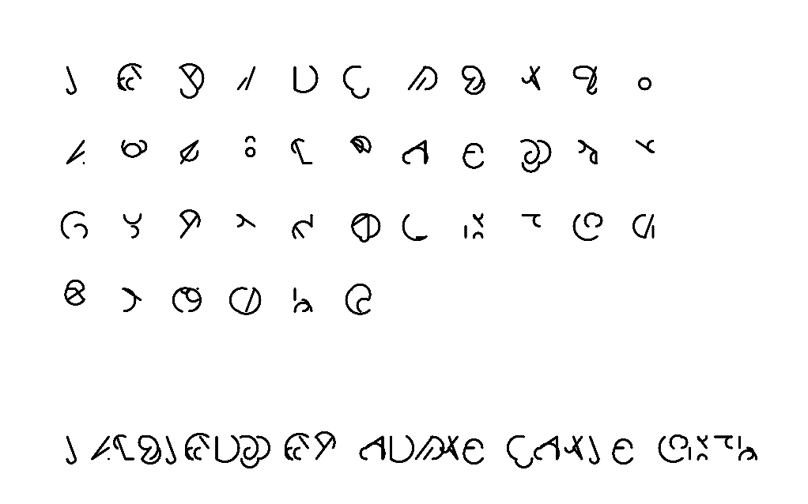
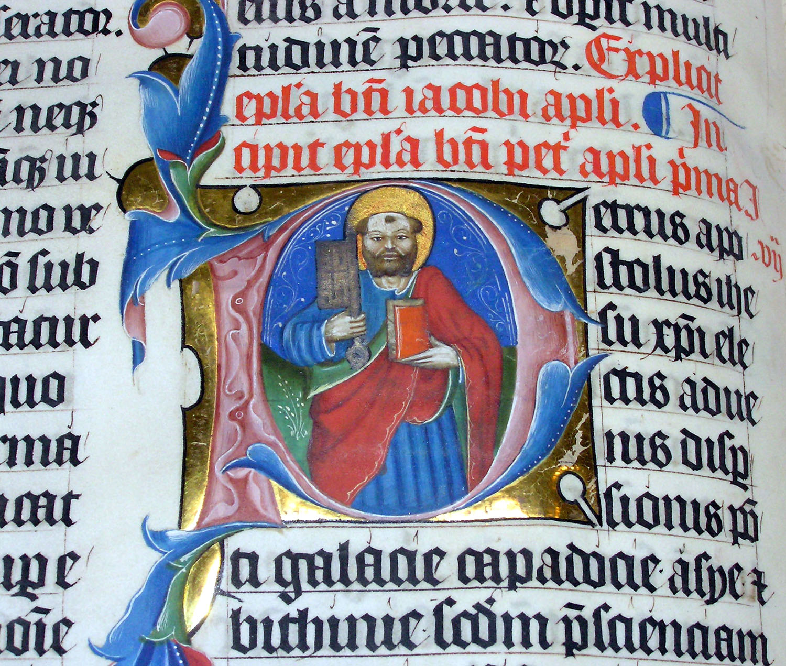
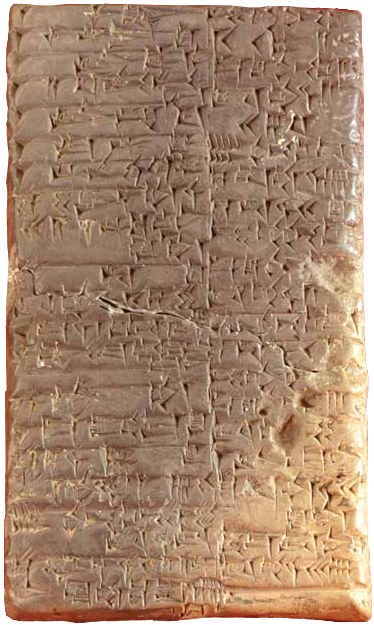
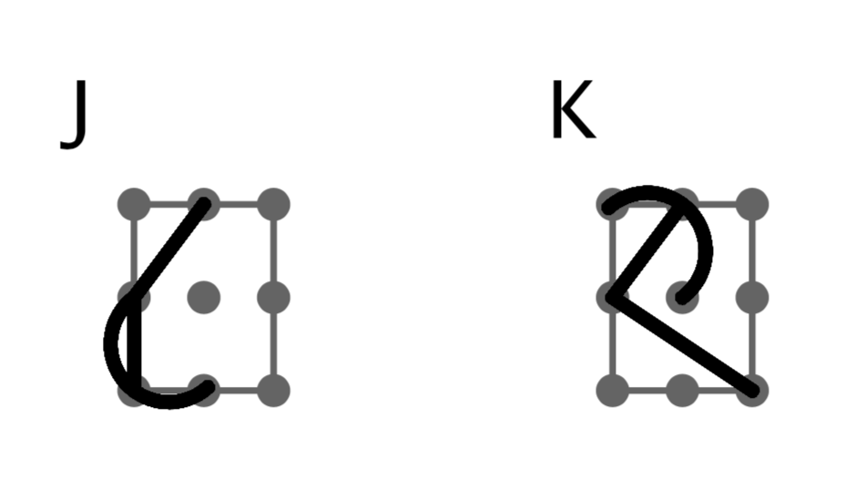

Helsinki
========

I am fascinated by the incredible variety of signs that humans have created throughout our history in order to communicate between each other. This sketch is a humble tribute to this amazing resource. This is also the most complex sketch I have made so far for this project, so this account is doomed to be incomplete. I invite the reader to inspect the code and try to understand in more detail by herself.

.. figure:: ../assets/xxxx.png
   :alt: Writing symbols

The algorithm
-------------

Rather than creating an alphabet, I wanted to create an alphabet generator, but what does that even mean? Real alphabets come from a people's everyday communication needs and I could never dream of achieving something of the same complexity and elegance with a dumb algorithm. Nevertheless I wanted to create alphabets that look interesting enough and that could fool someone who is not paying a lot of attention.

My main inspiration were handwritten letters, because they embed their gestural inception in their form. That is why a manuscript written with a feather has a contrast of think and thin strokes, which lends them their character.

  A closeup of the illuminated letter P in the 1407AD Latin Bible on display in Malmesbury Abbey, Wiltshire, England. It was hand written in Belgium, by Gerard Brils, for reading aloud in a monastery. Photo: Adrian Pingstone. Source: `https://en.wikipedia.org/wiki/File:Illuminated.bible.closeup.arp.jpg <https://en.wikipedia.org/wiki/File:Illuminated.bible.closeup.arp.jpg>`_

The Sumerian script known as _cuneiform_ owes its shape to the wedges left by the stylus used to write it on clay tablets. The system is composed of simple stylus strokes combine in different ways.

  Cuneiform script tablet from the Kirkor Minassian collection in the Library of Congress. From Year 6 in the reign from Amar-Suena/Amar-Sin between 2041 and 2040 BC. `http://hdl.loc.gov/loc.amed/amcune.cf0013 <http://hdl.loc.gov/loc.amed/amcune.cf0013>`_. Source: `https://en.wikipedia.org/wiki/File:Cuneiform_script2.png <https://en.wikipedia.org/wiki/File:Cuneiform_script2.png>`_

In my program, the "gestures" are very limited: either a straight line or an arc. This is what makes the end result look like a real lettering system and not just random lines. The other element is :ref:`the letter grid <the-grid>`.

My translation from hand gestures to computer-generated letters was quite straightforward:

#. Decide how many "pen strokes" to draw;
#. Choose a starting point for it on the grid (:ref:`ref. to image below <the-grid>`);
#. Choose an ending point for it on the grid;
#. Choose a line type: straight or an arc;
#. Draw the line from starting to ending point;
#. If this was the last line, stop, otherwise:
#. choose if starting point is same as current ending point or random;
#. go back to #3;

.. _the-grid:

  The grid with some generated strokes. The case on the left has two strokes, the second of which starts where the first stroke ended. The case on the right has three strokes, two of them share a point and one with independent points.

This is also the structure of the main algorithm and a description of the program core. What is missing from here is the positioning system — where to draw the letters for the full alphabet — and the sample text.

The code
--------

The program is divided into five blocks. The main sketch contains the ``setup()`` and ``draw()`` functions; keyboard shortcuts for the user interface; and the instantiation of the group of letters:

.. code:: java

  CreateLetters letters;

Followed by the call to the function:

.. code:: java

  void createLetters(){
    float rectWidth = width/24;
    float em = rectWidth * 0.75;
    float lineHeight = em / 0.75;

    letters = new CreateLetters(lineHeight, em);
  }

within ``setup()``, and finally we draw the letters to the screen:

.. code:: java

  letters.returnLetters();

Since this is a fictional alphabet, I decided to map each letter to an actual letter from a real alphabet. You can use whichever writing symbols you like for this, and you can have as many as you want (these can be changed by the user with a keyboard shortcut). My version has the English and Finnish alphabets with and without numbers. This is done the following way:

.. code:: java

  // Set which alphabet to use
  int alphabetIndex = 3;

  String[] alphabetsList = {
    "Latin (English)",
    "Latin with numbers",
    "Finnish/Swedish",
    "Finnish/Swedish with numbers"
  };

  char[][] alphabet = {
    // 0: Latin (English)
    {'A','B','C','D','E','F','G','H','I','J','K','L','M','N','O','P','Q','R','S','T','U','V','W','X','Y','Z'},
    // 1: Latin with numbers
    {'A','B','C','D','E','F','G','H','I','J','K','L','M','N','O','P','Q','R','S','T','U','V','W','X','Y','Z','0','1','2','3','4','5','6','7','8','9'},
    // 2: Finnish/Swedish
    {'A','B','C','D','E','F','G','H','I','J','K','L','M','N','O','P','Q','R','S','T','U','V','W','X','Y','Z','Ä','Ö','Å'},
    // 3: Finnish/Swedish with numbers
    {'A','B','C','D','E','F','G','H','I','J','K','L','M','N','O','P','Q','R','S','T','U','V','W','X','Y','Z','Ä','Ö','Å','0','1','2','3','4','5','6','7','8','9'}
  };

  int numLetters = alphabet[alphabetIndex].length;

The ``alphabetIndex`` variable initializes the alphabet (Finnish/Swedish in this case); ``alphabetsList`` is just for screen display; ``alphabet`` is the actual array containing the letters that will be mapped. Note that this is an array of arrays of chars (indicated by the single quotes).

Since there is no difference in the algorithm for generating numbers their appearance is the same as that of the letters. A nice addition to this program would be to write a separate algorithm for the numbers.

Writing a sample text is optional, but that allows you to send a cryptic message to your friends — like I did with Half.

.. code:: java

  letters.writeText();
