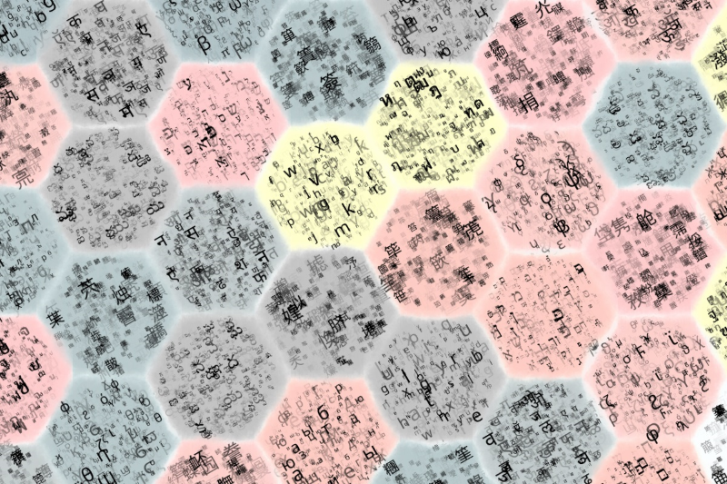

Stockholm
=========

Background
**********
An alphabet is a collection of graphic elements of the writing system of a given language. What I didn't know when I proposed the theme is that not all writing systems are based on  alphabets. In several languages the building blocks of the writing systems are syllables, not letters, and the correct term in this case is ?. 
It is not certain why alphabets have such name, but its suggested that it correlates to the regularity of equivalent symbols in distinct languages, in the same order, in particular of the letter A. 

Inspiration
***********
Reading about the omni-presence of the letter A in many languages reminded of the short story Aleph, from Jorge Luís Borges, which in turn reminded me of the The Babel Library::

      Borges' narrator describes how his universe consists of an enormous expanse of. 
      adjacent hexagonal rooms, each of which contains the bare necessities for human  
      survival--and four walls of bookshelves.

When I read Wikipedias entry I immediately hooked on drawing my representation of the Babel library using adjacent hexagons, just like an hexagonal tiling:

.. figure:: /assets/hexagontiling.png

My first sketch was to draw a regular hexagon as a shape. In this code I use radius in reference to the circumference containing the hexagon, which happens to be the same as the side of the regular hexagon ( l). 
(code for polygon)

(image output of above)

After that, I created a list of hexagons, drawn side-by-side. You notice here that in order to match the hexagonal tiling pattern above, every other row must be translated on the x axis.
(image for polygons).