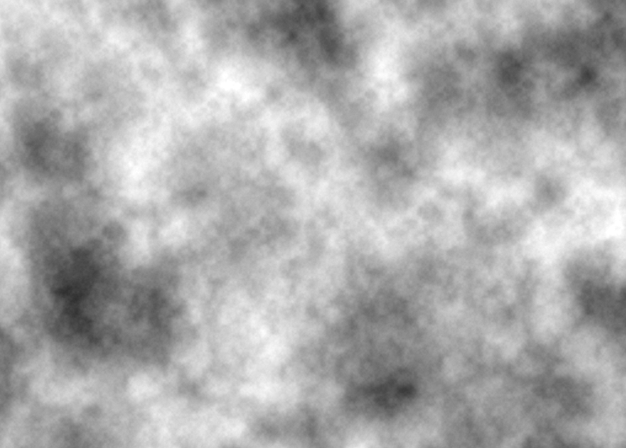
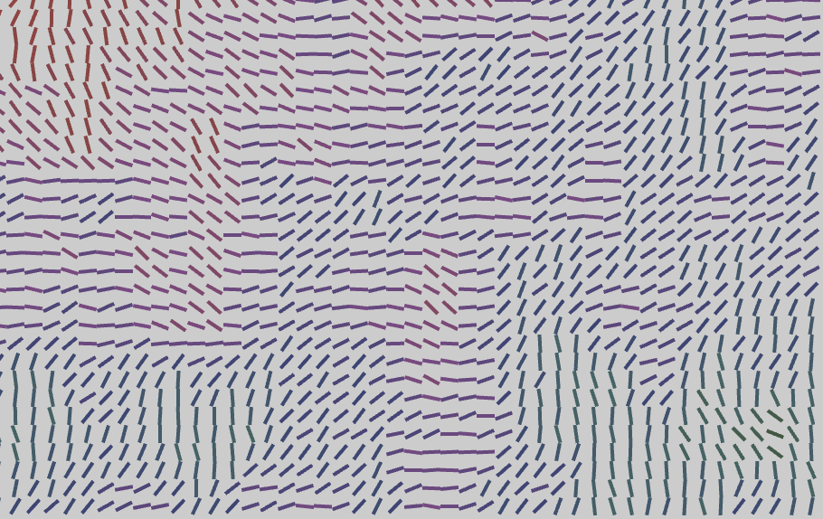
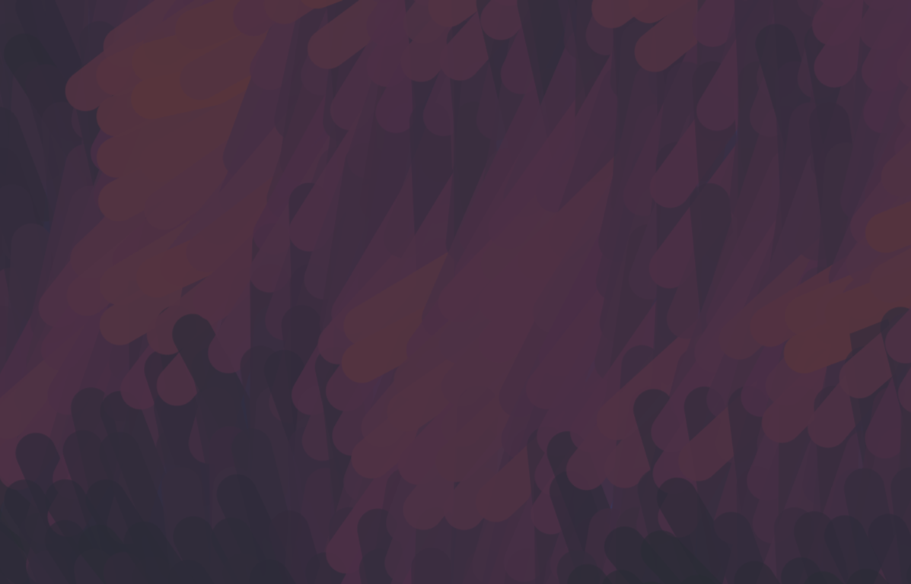

Helsinki
========

.. figure:: ../assets/06-helsinki.png
  :alt:

Creating fluid forms is somewhat against the nature of a computer program. I proposed this theme to try to explore ways to do exactly that. I originally thought it would be more difficult, but there are many tools available nowadays to help us break the orthogonality of the computer display. One of my favourites is Perlin noise. Because of that, this program turned out to be one of the simplest I have made for this project.

Some would say I cheated by starting this sketch based on a `Processing example by Daniel Shiffman <https://processing.org/examples/noise2d.html>`_. You can read the comments from that to understand how it works in more detail, but basically it uses Processing's built-in ``noise()`` to generate smoothly varying noise (also known as Perlin noise, after Ken Perlin, the developer of this algorithm). This function accepts two parameters, which, in this case, are incremented at each row and column.

  Daniel Shiffman's Noise2D example. Here I changed the increment to 0.01 instead of the original 0.02 so that the variation is not so wide.

What I wanted in this sketch was to somehow mimic brush strokes, as in an oil paiting. So I thought of drawing lines whose rotation follow the variation of the Perlin noise. This is done by imagining a circle around the point where Shiffman's pixel would be ( ``noise(xoff, yoff)`` ) and use that value to rotate a line dividing that circle in two:

.. code:: java

  float angle = noise(xoff, yoff) * 360;

  float x1 = cos(radians(angle)) * lineLength + x;
  float y1 = sin(radians(angle)) * lineLength + y;
  float x2 = cos(radians(angle+180)) * lineLength + x;
  float y2 = sin(radians(angle+180)) * lineLength + y;

Then we only need to draw the line using these coordinates. We also use the noise values to change the color of the line at that point:

.. code:: java

  stroke(angle + initAngle, angle/3, angle/3, angle);
  line(x1, y1, x2, y2);

  Rotated lines instead of points.

The final trick is to make the lines bigger than the grid so that they will overlap each other. We also make them thicker to mimic a larger brush. This creates the impression of strokes that vary randomly but smoothly and whose color follow this movement.

  A detail of the final image showing the "brush strokes".

The full code for the loop that draws the strokes looks like this:

.. code:: java

  for (int x = 0; x < width; x += gridSize) {
    xoff += increment;   // Increment xoff

    float yoff = 0.0;   // For every xoff, start yoff at 0

    for (int y = 0; y < height; y += gridSize) {
      yoff += increment; // Increment yoff

      // Calculate noise and scale by 360
      float angle = noise(xoff, yoff) * 360;

      float x1 = cos(radians(angle)) * lineLength + x;
      float y1 = sin(radians(angle)) * lineLength + y;
      float x2 = cos(radians(angle+180)) * lineLength + x;
      float y2 = sin(radians(angle+180)) * lineLength + y;

      stroke(angle + initAngle, angle/3, angle/3, angle);
      line(x1, y1, x2, y2);
    }
  }

Since the lines do not cover all the canvas it is important to chose a color for the background:

.. code:: java

  float ang = 240;
  background(ang, ang/2, ang/2, 360);

We need a few initialization values at the beginning of the file are — you can change them to produce different results, but I found these the ideal:

.. code:: java

  float increment = 0.01;
  int gridSize = 5;
  int lineLength = gridSize*2;
  float initAngle;
