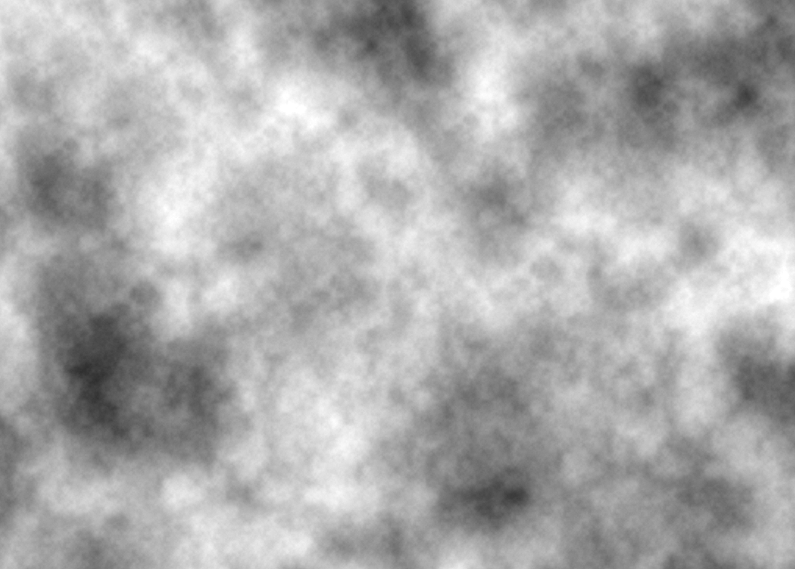

Helsinki
========

.. figure:: ../assets/06-helsinki.png
   :alt:

Creating fluid forms is somewhat against the nature of a computer program. I proposed this theme to try to explore ways to do exactly that. I originally thought it would be more difficult, but there are many tools available nowadays to help us break the orthogonality of the computer display. One of my favourites is Perlin noise. Because of that, this program turned out to be one of the simplest I have made for this project.

Some would say I cheated by starting this sketch based on a `Processing example by Daniel Shiffman <https://processing.org/examples/noise2d.html>`_. You can read the comments from that to understand how it works in more detail, but basically it uses Processing's built-in ``noise()`` to generate smoothly varying noise (also known as Perlin noise, after Ken Perlin, the developer of this algorithm). This function accepts two parameters, which, in this case, are incremented at each row and column.

  Daniel Shiffman's Noise2D example. Here I changed the increment to 0.01 instead of the original 0.02 so that the variation is not so wide.
