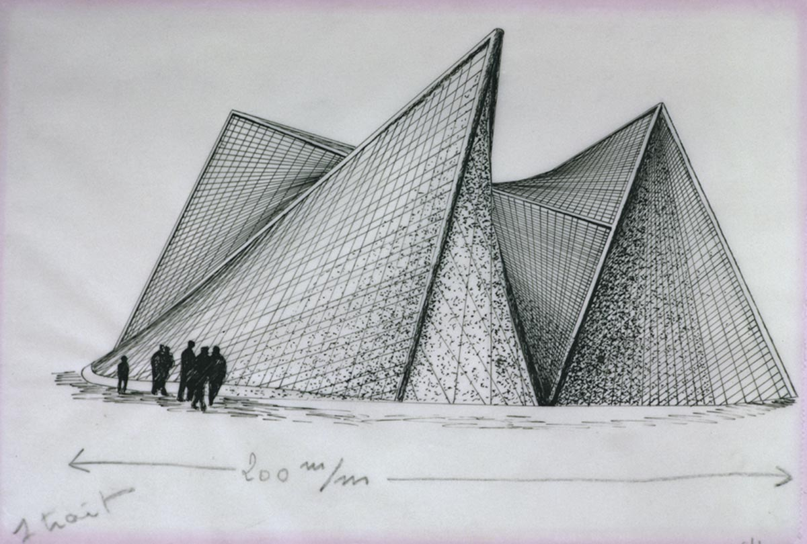

Helsinki
========

.. figure:: ../assets/11-helsinki.png
   :alt: Final drawing

   Final drawing

Creative process
----------------

Time makes me think of music (which probably raised the idea for the following chapter); music makes me think of a score. For some reason the first thing that came to my mind within this subject was Iannis Xenakis's notation of orchestral glissandi:

.. figure:: ../assets/11-Xenakis-Iannis-1200x926.jpg
   :alt: Metastasis (1953)

   Metastasis (1953)

He also realised these forms visually in his work as an architect :cite:`xenakis_philips_pavilion`.

   Drawing by Xenakis Philips pavilion, 1956, 1957.

I decided to explore this theme and create an algorithmic representation of those glissandi.

References
----------

.. bibliography:: references.bib
