Helsinki
========

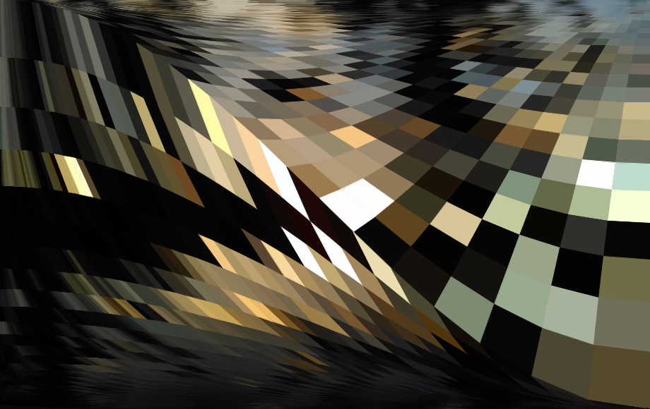

This week's challenge was inspired by `M.C. Escher's "Print Gallery" <https://www.mcescher.com/gallery/recognition-success/print-gallery/>`_. In this work Escher creates a loop that spans the art piece in a gallery, the gallery itself, the city, and back to the piece in a gallery. The elements in different levels are merged into a continuum.

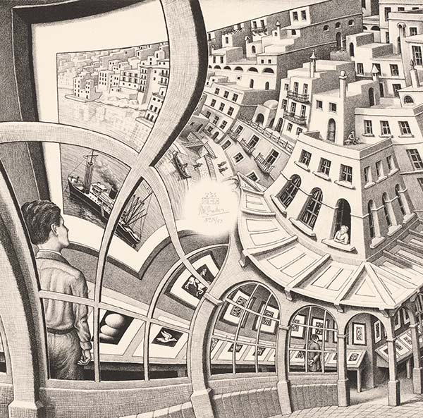

The creative process
--------------------

Pixels are the atoms of computer graphics and I wanted to play with the idea of these elements expanding and contracting in a way that resembled Escher's approach — although orders of magnitude less ambitious. The idea was to start with pixels in "natural size", then increase them at each iteration until they take up a large area. The pixels didn't turn out very large in the final image because the image looked more interesting with a smaller variation, as can be seen on the variation:

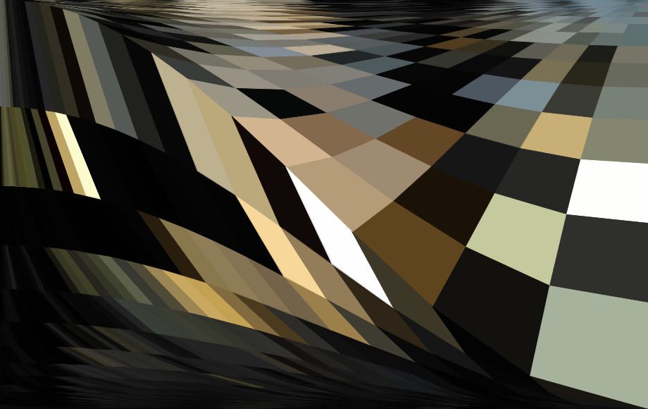

The biggest loss occurs in the middle of the image, where the sunset would be located in the original image:

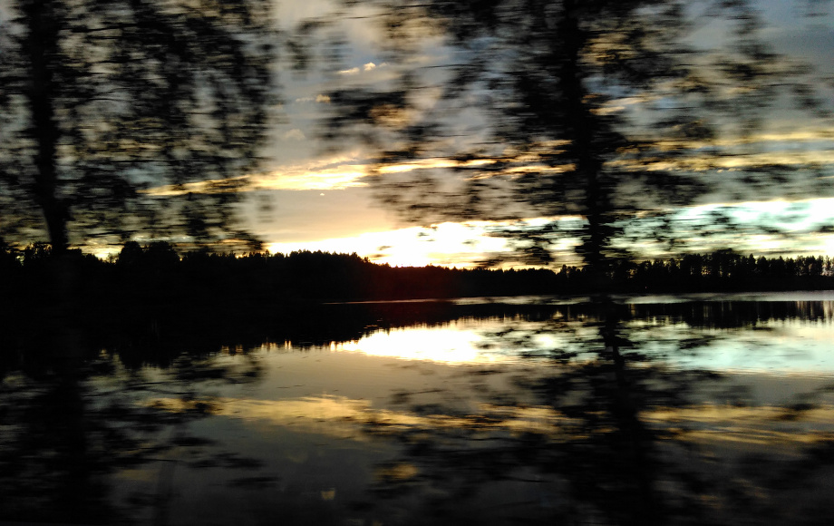

The reason is that this is a visually rich area and all of the small variations are filtered out of the final result.

The algorithm
-------------

We start with an exponential function (y=t\ :superscript:`3`):

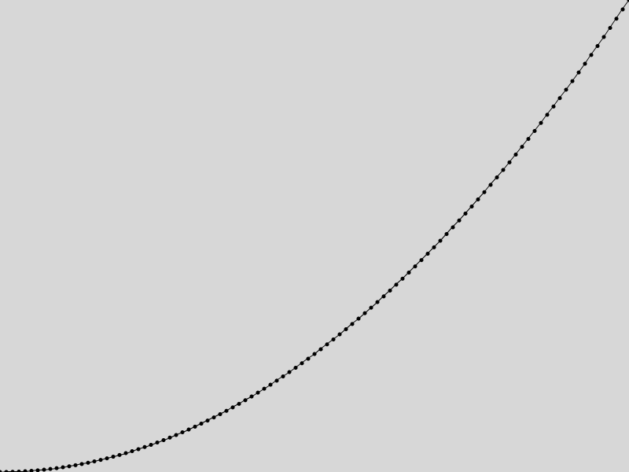

.. code:: java

  float incr = 0.01; // Increment; smaller values create less spaced points
  float deform = 3; // How pronounced the deformation of the grid is;
                    // larger values make the right-most spacing larger

  void setup() {
    size(800, 600);
    noLoop();
    noStroke();
    fill(0);
  }

  void draw() {
    background(255);
    for(float i = 0; i < 1; i += incr){
      float x = i*width;                          // just scale 'i' to the screen width
      float y = height - pow(i, deform) * height; // y = i^3 (0 <= i < 1)
      noStroke();
      ellipse(x, y, 5, 5);
    }
  }

In the above image the horizontal axis is constant while the vertical axis varies exponentially. But if we instead keep the vertical axis constant and vary the horizontal one we get the same curve, but as if it was viewed from the side.

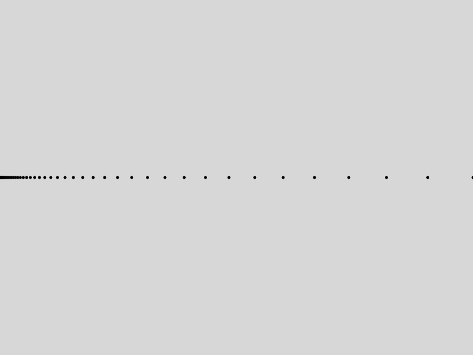

.. code:: java

  float incrX = 0.01;
  float deform = 10; // In the previous example this was 3,
                     // but with a larger number it is easier to see the variation

  void setup() {
    size(800, 600);
    noLoop();
    noStroke();
    fill(0);
  }

  void draw() {
    background(255);
    for(float i = 0; i < 1; i += incrX){
      float x = pow(i, deform) * width;   // x = i^10
      float y = height/2;                 // constant height
      noStroke();
      ellipse(x, y, 5, 5);
    }
  }

Now we can add the vertical axis with the same logic. But if we repeat it exactly it will look boring:

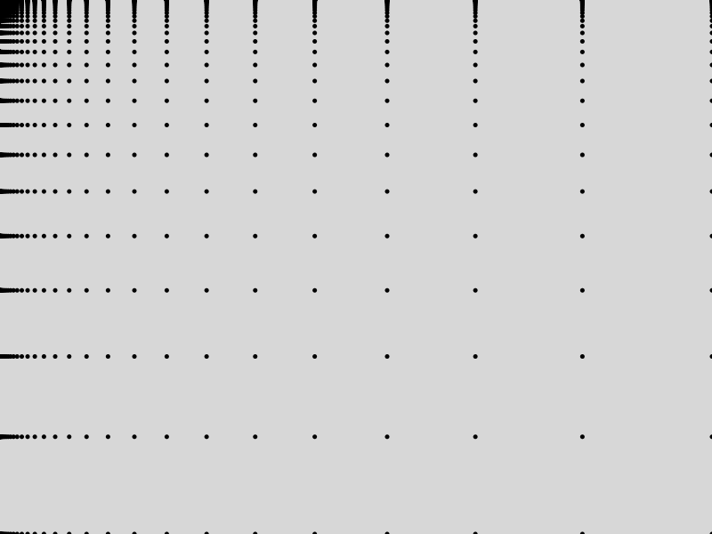

So instead of using the same formula (``float y = pow(j, deform) * height;``) for the ``y`` values we use that as basis for a cosine wave which has a larger and larger amplitude as it goes from the top to the bottom.

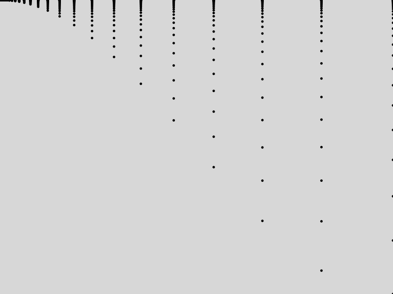

.. code:: java

  float incrX = 0.01;
  float incrY = 0.01;
  float deform = 20;

  void setup() {
    size(800, 600);
    noLoop();
    noStroke();
    fill(0);
  }

  void draw() {
    background(215);
    for(float j = 0; j < 1; j += incrY){            // vertical axis
      for(float i = 0; i < 1; i += incrX){          // horizontal axis
        float x = pow(i, deform) * width;           // x = i^20
        float ang = map(x, 0, width, PI, TWO_PI);   // Pi <= ang <= 2*Pi to draw a nice curve
        float varY = pow(j, deform) * height;       // varY = j^20
        float y = (cos(ang)/2 + 0.5) * varY;        // from top to bottom describing a cosine curve

        noStroke();
        ellipse(x, y, 5, 5);
      }
    }
  }

Now, the original idea was to draw approximately squared pixels and the above are horizontally streched, especially at the top of the image. (Not to mention they are still quite boring.) Let's then replace the static `deform` on the horizontal axis (``float x = pow(i, powerX) * width;``) with a varying value (``float powerX = pow(j, distort) * deform;``), and use that as the new exponent (``float x = pow(i, powerX) * width;``).

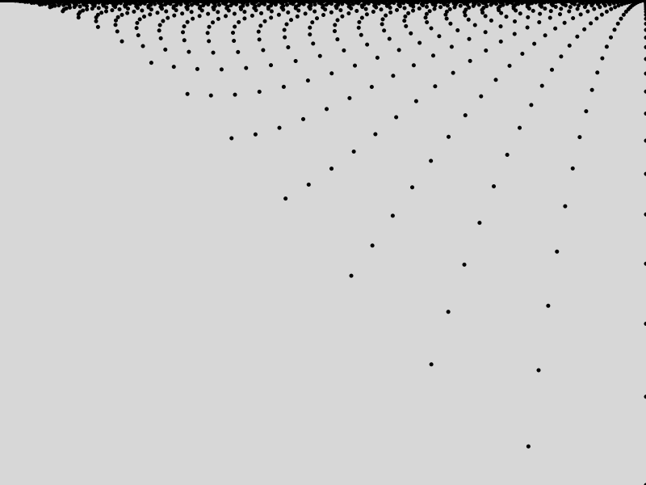

To get from here to the final code (available at `https://github.com/haschdl/dear-gen-code <https://github.com/haschdl/dear-gen-code>`_) we need to draw rectangles rather than points. For that we use the current ``i`` and ``j``, and also get values from the previous steps (``i-incrX``, ``j-incrY``) and create four distinct points: ``x1``, ``x2``, ``y1``, ``y2``, with their own set of exponents and angle variations.

To make it more compelling we use colors from an image, but we don't really care about making it figurative, we only need a nice color palette with an interesting pattern. For each rectangle we can grab the color of the image at the same position (in our case the top left vertex: ``color c = img.get((int)x1, (int)y1);``).

You will notice that the end result is not symetrical as the "pixels" increase in size from left to right. If we use the exact same logic for the second half of the image the rectangles from each side will not match each other. In the end we cannot avoid the streched rectangles, but I decided to incorporate this effect.

Variations
----------

You can play with the variables to get different results:

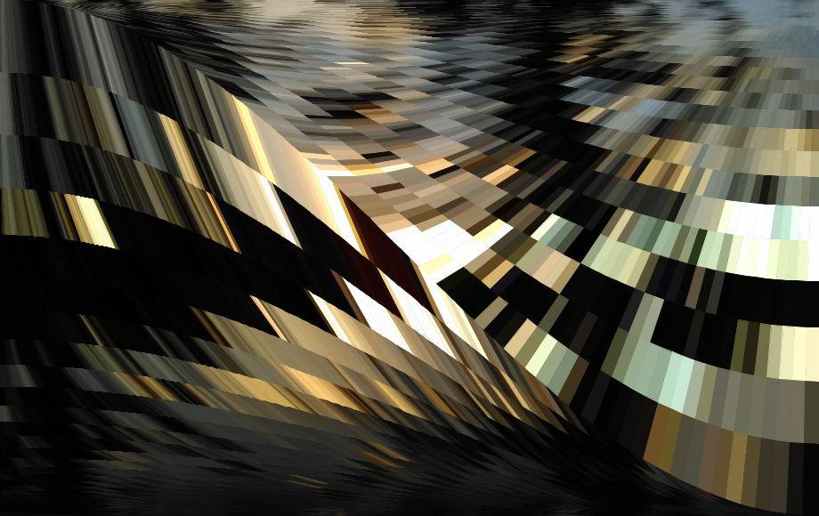

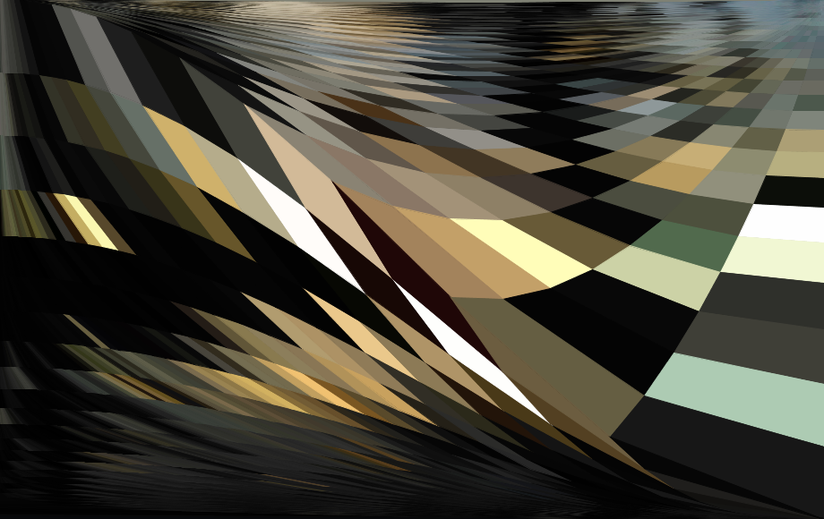

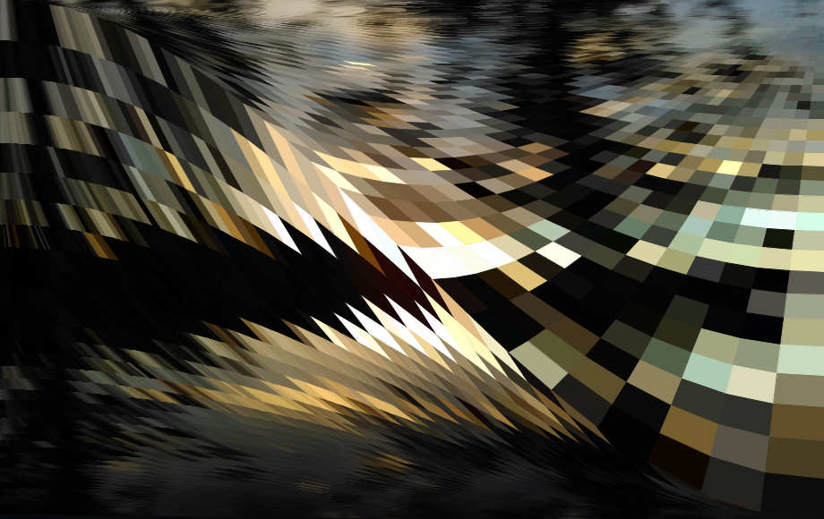

You can also use different images and leverage their color palette.

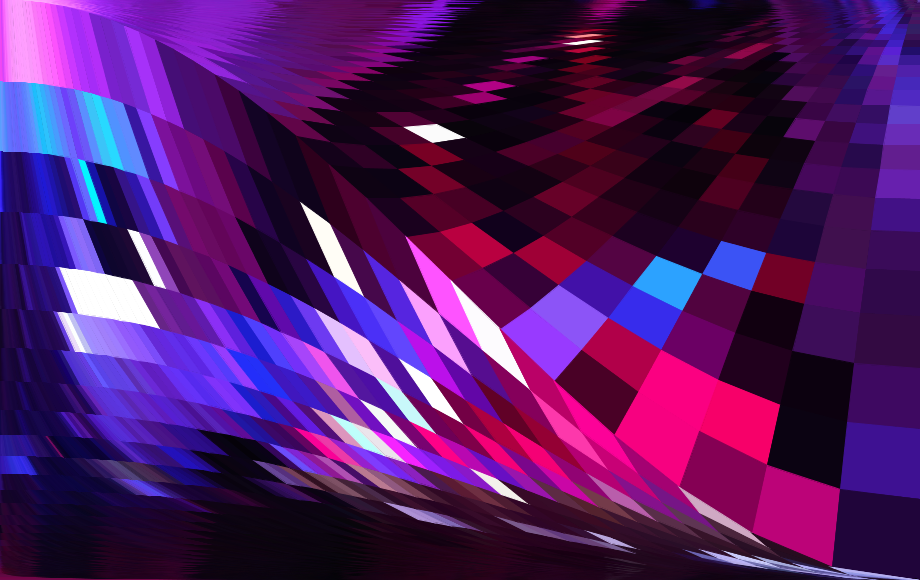

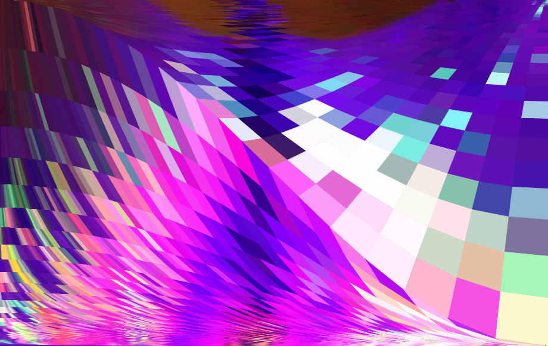
